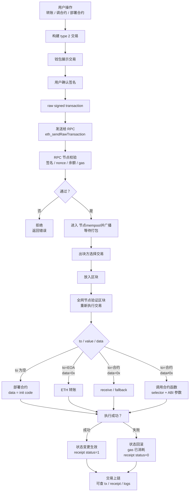

读前提醒，本文只代表作者个人观点。


========


钱包作为用户在实际和web3世界进行交互时经由的账号，应该说算是探索web3的门户了（在个人理解中）。所以，本次探索的内容就基于这个认识，着重探索了一下以钱包为主体，看看一个钱包可以在链上做到的基本行动。这是项目展示页面：[https://evm-wallet.block.dreaifehebi.com/](https://evm-wallet.block.dreaifehebi.com/)


::github{repo="https://github.com/dreaifeHebi/evm-eoa-wallet-demo"}


# 钱包的创建及其行动范围


## 钱包的创建和导入

- 钱包的创建

    一般而言，只要你创建一个符合[1,n)的随机数，都可以算得上一个合格的钱包密钥，而这个密钥d*G得到的公钥通过keccak256算出的钱包地址，就是此时你创建的这个密钥的存在在block chain上的一个钱包。换句话说，在理论上，钱包一直存在在block chain上，而在你创建了一个密钥，可以对应到这个地址，你便可以作为它的owner来激活并使用它了（没有被别人使用的情况下）。


    但是这样每次都是需要特地创建一个随机数，才能生成一个钱包的话，还是有点太过麻烦/而且也并不好记忆一个随机的16位大数，那么有没有更简单的方式可以批量化地创建多个符合模式的钱包，还能让我在恢复的时候只用一个统一的方便记忆的内容就能一次性恢复它们呢？这就是HD钱包（Hierarchical Deterministic Wallet），或者也可以说说是现在最常用的助记词钱包。


    它通过BIP-39来生成一套助记词和其seed，然后通过BIP-32从seed派生出m，最后通过BIP-44来按照m/44‘/60’/acc‘/0/i的格式来进行钱包的批量计算生成。

- 钱包的恢复/导入

    对于普通钱包，就是只要记住0x开头的那一串密钥就可以恢复了（记忆力惊人的话）。


    而对于更常用的HD wallet，则是通过走上述的那套派生流程来恢复一些常用的地址。具体步骤可以从BIP-39生成助记词后无缝衔接。


## 验证和交易


如果按照钱包发起的行动是否可以直接改变链上状态来划分的话，大概可以分成验证和交易这两类。

- 验证

    验证，顾名思义，如之前的blog所说的，通过签名一段EIP-191的字段（一般为SIWE格式），让接收签名的服务方完成钱包的所有权验证，这就是它所做的事情。


    ::site{url="https://dreaife.tokyo/evm-wallet-login/"}


    当然，这样钱包如果只想做像签名这样简单的操作的话，那么对于钱包而言可以做的事情就太少了，于是，EIP-712就此出现。


    通过定义一段共识的签名字段，从而让用户只用通过签名，就可以授权给DApp或者其他服务来发起交易来调用链上的智能合约执行签名内容，从而让用户可以更加方便便捷地控制链上的资产。


    当然还有像EIP-7702这样的让EOA钱包获得接近合约钱包能力的协议，不过这里主要考虑的是EOA钱包相关，就没有深入了解了。

- 交易

    交易，是钱包主动改变链上状态的基本方式。它通常包含to｜value｜data｜nonce｜gas｜chainId这些基本内容。通过控制这些字段的内容，钱包发起的交易可以做到：转账，调用合约，部署合约等基本操作。


# HD钱包的创建


这里开始介绍对于现在最常用的HD钱包，对于ETH链上的钱包，会是如何生成出助记词，并由此派生出$2^{31}*2^{31} $（account hardened派生的$2^{31}$种可能性*address_index non-hardened派生的$2^{31}$种可能性）可能性的钱包私钥。


## HD钱包的私钥创建流程


对于一次从生成助记词开始到派生出一个可以实际控制钱包地址的私钥，一般会遵循这样的一个流程。

- BIP-39生成助记词和seed
- BIP-32通过seed派生出主密钥m
- BIP-44则是对于Ethereum使用的m/44’/60’/account’/0/i这样的派生规则，通过account和i来确定性地派生出一个私钥

下面对于每步流程进行详细介绍。


## 生成助记词和seed


助记词的生成

- 生成随机熵 entropy

    BIP-39生成助记词时，首先是生成一个128/160/192/224/256 bit的随机数。


    它们分别对应12位/15位/18位/21位/24位 的助记词。这里我们用256bit entropy，即生成24位助记词作为例子。

- 对entropy 进行SHA-256计算，获得一个新的256bit数
- 取长度为ENT/32的checksum

    换句话说，先对SHA-256计算后的数据计算checksum，然后取长度为ENT/32的checksum结果的前这么多位。对于256bit的随机数而言，就是取checksum的前8bit。

- 对于entropy和checksum进行拼接，得到一个256bit+8bit，即264bit的数
- 这里我们按照11bit来对这个数据进行分组，可以得到264/11 = 24组，这也是为什么256bit对应了24位助记词
- 然后对于每组，在2048（$2^{11}$）个的BIP-39 wordlist中挑选出对应word
- 此时获得的24位word就是一般在HD钱包中使用的助记词

然后是助记词到seed的生成


这里是通过PBKDF2-HMAC-SHA512来计算出一个512bit的seed。具体计算如下：


$PBKDF2-HMAC-SHA512(password=mnemonic ,salt="mnemonic"+password,iteration=2048,dkLen=64bytes)$


即把utf8 byte stream话的助记词作为password，salt为“mnemonic”+password，进行HMAC-SHA512 iteration=2048次。第一次的U1是通过助记词和password 以及block_index来计算(U1=HMAC(password,salt || INT(block_index)))，后面的U2开始都是用上一次计算的$U_{i-1}$作为key来进行HMAC-SHA512的计算(U2=HMAC(password, U1))。


由此最终计算出的第一个block的result = U1 xor U2 xor … xor U2048，因为512bit的输出就为要求的长度64byte，所以block只有一个，此时输出的result就是按照BIP-39规则生成出来的seed。


## 主密钥m的派生


根据BIP-32，对于上面计算出来的seed再执行一轮HMAC-SHA512加密得到I，具体内容如下。


$I = HMAC-SHA512(key = \text{``Bitcoin seed''}, data = seed)
$


此时得到了一个512bit的I，按照256bit的长度，可以把它拆出左右两半长度各为256bit的数字。


对于左边的$I_L$，作为主密钥master private key；对于右边的$I_R$，作为master chain code。


它们会用于下一步BIP-44的派生计算中。


## 一个特定密钥的派生计算


接下来就是BIP-44是如何规定通过主密钥，沿着m/44’/60’/account’/0/i路径来通过BIP-32计算出一个特定密钥的了。


这里因为开始进入secp256k1椭圆曲线的群计算范畴了，所以如果不了解基础知识的话，欢迎看我之前的原理证明（


::site{url="https://dreaife.tokyo/eoa-sign-verify/"}

- 派生路径m/44’/60’/account’/0/i

    这里先介绍一下派生路径到底是什么吧。


    派生路径可以理解为一个以主密钥m为根节点的深度为6层的数，每层都是一个$2^{32}$的数。但是对于这个$2^{32}$的数，一般只会使用其中一半，即$2^{31}$的数。这是由每层数字右上角的‘是否hardened来决定这层的数字i是单纯使用i（[0,$2^{31}$)），还是使用i‘=i+$2^{31}$。


    同时这里的hardened标记也会影响向子节点计算时的计算方式。


    而对于m后面44’/60’/account’/0/i这五层的含义，每层分别是：

    - 44‘：BIP-44规定的目标
    - 60’：对于Ethereum使用的coin type
    - account‘：派生时选择的账户编号
    - 0：external chain，一般用于普通收款地址
    - i：对于每个账户的，第i个地址
- non-hardened 子节点计算方式

    对于某层子节点的数字i，可以通过父节点的密钥IL(下称pPk)和chainCode IR(下称pCc)通过下式计算得出子节点的I。


    $$
    I = HMAC-SHA512(key=pCc,data=(serP(pPk*G) || ser32(i))
    $$


    其中，$serP(pPk*G)$意味着，0x02/0x03 || (pPk*G)_x)，pPk*G即为父节点的公钥，0x02还是0x03由计算出的父节点公钥（mod p）的y/p-y为奇数还是偶数决定。


    对于得到的I，同样按照256bit的长度，拆分为左右IL和IR。


    对于该子节点密钥child private key就为(IL+parent private key) mod n


    而子节点的child chain code，则为IR

- hardened 子节点计算方式

    对于某层子节点的数字i’，可以通过父节点的密钥IL(下称pPk)和chainCode IR(下称pCc)通过下式计算得出子节点的I。


    $$
    I = HMAC-SHA512(key=pCc,password=(0x00 || ser256(pPk) || ser32(i + 2^{31}))
    $$


    其中0x00意味着直接使用私钥pPk，所以不再需要判断公钥的y的奇偶性。


    对于得到的I，同样按照256bit的长度，拆分为左右IL和IR。


    对于该子节点密钥child private key就为`(IL+parent private key) mod n`


    而子节点的child chain code，则为`IR`

- 最终得到的私钥

    按照m/44’/60’/account’/0/i这样一层层派生，最终达到address_index i的叶子节点，在这个选定的节点上计算出的该子节点的child private key，即为该账户地址的私钥d。它的实际账户地址，可以通过一般的keccak256计算私钥d*G，并取后20byte得到。


    同时对于这个地址，有通过EIP-55的checksum对普通地址转换成大小写地址来进行校验的方式来保证地址格式的合法性（检查字符串格式/输入错误）。

    > EIP-55是一种不改变地址字母，只根据该地址的keccak256计算结果改变其大小写。对于i位上的数字，如果其地址为a-f的同时，其keccak256计算结果对应的i位≥8，则将其大写，否则不变。

# 钱包的交易


对于一个交易，一般可以分为为了让它可以上链的交易外壳和费用模型，以及为了让交易行为真正起作用的to / value / data这些关键参数，以及nonce/chainId这些验证参数。


## 交易的结构


对于一个普通的EIP-1559/type2交易，大概的内部结构会是这样：


```javascript
type: 0x02

chainId
nonce

maxPriorityFeePerGas
maxFeePerGas
gasLimit

to
value
data

accessList

signatureYParity
signatureR
signatureS
```


这里只是对于属性的列举，一段未签名的交易，其一般更类似于json的格式：


```javascript
{
  chainId: 1,
  nonce: 42,
  to: "0xContractOrEOA...",
  value: "1000000000000000000",
  data: "0x...",
  gasLimit: "21000",
  maxFeePerGas: "...",
  maxPriorityFeePerGas: "..."
}
```


签名后会和验证时签名的结果一样出来r/s/v，将它们追加到上述json到尾部。


然后按照下述的结构，将交易内容和签名构成的交易编码成一串bytes，作为raw signed trans action。对于这个编码完的交易，即可发送给RPC进行广播，准备上链。


```javascript
0x02 || rlp([
  chainId,
  nonce,
  maxPriorityFeePerGas,
  maxFeePerGas,
  gasLimit,
  to,
  value,
  data,
  accessList,
  yParity,
  r,
  s
])
```


其中，每个字段作用分别为：

- chainId: 防止同一笔交易被拿到另一条链重放
- nonce: 账户交易序号，防止同一笔交易重复执行，也决定交易顺序（注意这里的nonce是当前这条链上的操作钱包的对于nonce，对于上次交易的nonce必须是按照+1的顺序进行）
- to: 目标地址，空则是部署合约
- value: 附带发送的原生币数量
- data/input: 合约调用 calldata，或部署合约时的 init code
- gasLimit: 这笔交易最多允许消耗多少 gas
- maxFeePerGas: 用户愿意支付的最高单价
- maxPriorityFeePerGas: 给 validator/proposer 的小费上限
- signature: EOA钱包对交易内容的签名

## 费用模型


对于费用模型，一般会分为这些：


| 类型                 | 名字                   | 重点                                                          |
| ------------------ | -------------------- | ----------------------------------------------------------- |
| legacy / 常说 type 0 | 旧交易                  | gasPrice + gasLimit，没有 typed envelope                       |
| type 1             | EIP-2930 access list | legacy 费用模型 gasPrice，额外带 accessList                         |
| type 2             | EIP-1559             | maxFeePerGas + maxPriorityFeePerGas + gasLimit              |
| type 3             | EIP-4844 blob tx     | 给 rollup 发 blob 数据，额外有 maxFeePerBlobGas、blobVersionedHashes |
| type 4             | EIP-7702 set-code tx | 让 EOA 通过 authorizationList 设置 delegation code，接近合约账户能力      |


这里因为主要只考虑现在常用的基础交易，所以上述结构以type2为参考进行编写。


## 一个交易的生命周期


对于一个交易，一般是在调用某应用/或者在钱包进行其内容构建和签名，然后再发送构建完的交易内容给RPC广播上链。大概的流程是这样：





# 钱包的验证


如引言所说，钱包可以做的除了可以直接上链的交易外，还有用于验证的不直接上链的验证行为。


## SIWE标准的普通钱包归属权验证


这里就是一个钱包在向一个调用的服务方证明用户存在对这个钱包的控制权。具体的内容可以参考上面放过的blog（


::site{url="https://dreaife.tokyo/evm-wallet-login/"}


## EIP-712，一种可以授权合约的验证


EIP-712是一种对712签名内容表示同意的授权验证，不过它更类似于交易中的签名，即是对于一个需要调用合约的参数进行签名，允许它调用合约（支持这种授权）中属于你名下的资产。当然它只是一个签名，最终想让这个签名内容改变链上状态，还得服务方把这个签名和调用内容合并为交易，交给这个签名对象的合约去调用。

- 签名内容

    签名的内容一般会是这样一种格式：


    ```javascript
    {
      types: {
        EIP712Domain: [
          { name: "name", type: "string" },
          { name: "version", type: "string" },
          { name: "chainId", type: "uint256" },
          { name: "verifyingContract", type: "address" }
        ],
        Permit: [
          { name: "owner", type: "address" },
          { name: "spender", type: "address" },
          { name: "value", type: "uint256" },
          { name: "nonce", type: "uint256" },
          { name: "deadline", type: "uint256" }
        ]
      },
      primaryType: "Permit",
      domain: {
        name: "DemoToken",
        version: "1",
        chainId: 1,
        verifyingContract: "0xTokenContract..."
      },
      message: {
        owner: "0xUser...",
        spender: "0xDappOrRouter...",
        value: "1000000000000000000",
        nonce: 0,
        deadline: 1710000000
      }
    }
    ```


    其中，types用来定义数据结构；primaryType作为签名的主结构，有Permit，Order，Forward和Request；domain则是指定签名的适用范围；message则是用户真正授权的内容。

- EIP-712的一个签名到使用的流程

    比如说对于permit类型的712，就是用户owner签名允许spender这个地址可以花value数量的token，有效期到deadline，nonce为n；然后把这个授权作为签名返回给DApp，DApp通过这个授权和内容发起交易permit( owner, spender, value, deadline, v, r, s)；调用合约验证签名符合签名内容后，根据授权内容进行变更。


    具体内容如下：

    1. 协议/合约先定义可签名结构
    Permit(owner, spender, value, nonce, deadline)
    2. DApp 构建 EIP-712 typed data
    包含 types、domain、primaryType、message
    3. 钱包展示签名内容
    用户看到是哪个 DApp、哪条链、哪个合约、授权内容是什么
    4. 用户确认后，EOA 私钥签名
    钱包计算 digest:
    keccak256("\x19\x01" || domainSeparator || hashStruct(message))
    然后签出 r/s/v
    5. 钱包把 signature 返回给 DApp / 服务方
    此时还没有上链，没有 gas，也没有状态变化
    6. DApp / relayer / 其他人构建一笔交易
    把 message 里的字段 + signature 一起传给合约
    7. 合约在链上重建同一个 digest
    然后用 ecrecover / ECDSA.recover 恢复 signer
    8. 合约检查签名是否合法
    signer 是否等于 owner
    nonce 是否没用过
    deadline 是否没过期
    chainId / verifyingContract / domain 是否匹配
    9. 检查通过后，合约执行状态变更
    例如设置 allowance、成交订单、执行 meta transaction
    10. 消耗 nonce
    防止同一份签名被重复使用

# 代码中的实现
