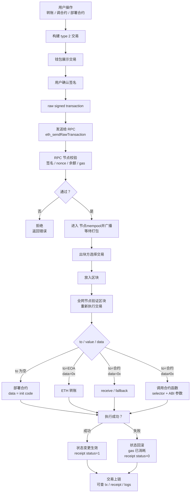

Before reading: this article represents only the author's personal views.


========


As the account users go through when interacting with the real world and the Web3 world, a wallet can be called the gateway to exploring Web3 (in my personal understanding). So this exploration is based on that understanding, focusing on the wallet itself and looking at the basic actions a wallet can perform on-chain. This is the project demo page: [https://evm-wallet.block.dreaifehebi.com/](https://evm-wallet.block.dreaifehebi.com/)


::github{repo="dreaifeHebi/evm-eoa-wallet-demo"}


# Wallet Creation and Its Scope of Actions


## Wallet Creation and Import

- Wallet creation

    Generally speaking, as long as you create a random number in [1,n), it can be considered a valid wallet private key. The wallet address calculated through keccak256 from the public key obtained by d*G is the on-chain wallet corresponding to the existence of this private key on the block chain. In other words, in theory, the wallet has always existed on the block chain; once you create a private key that can correspond to this address, you can activate and use it as its owner (assuming it has not been used by someone else).


    But if generating a wallet requires specially creating a random number every time, that is still a bit too troublesome, and it is also not easy to memorize a random 16-byte large number. So is there a simpler way to batch-create multiple wallets that follow a pattern, while also letting me recover them all at once with one unified and easy-to-remember piece of content? This is the HD wallet (Hierarchical Deterministic Wallet), or what can also be called the mnemonic wallet most commonly used today.


    It generates a set of mnemonic words and their seed through BIP-39, then derives m from the seed through BIP-32, and finally uses BIP-44 to batch-calculate and generate wallets according to the format m/44‘/60’/acc‘/0/i.

- Wallet recovery/import

    For an ordinary wallet, you only need to remember the private key string starting with 0x to recover it (if you have an amazing memory).


    For the more commonly used HD wallet, it recovers some commonly used addresses by following the derivation process above. The specific steps can connect seamlessly after generating the mnemonic through BIP-39.


## Verification and Transactions


If we classify wallet-initiated actions by whether they can directly change on-chain state, they can roughly be divided into two categories: verification and transactions.

- Verification

    Verification, as the name suggests and as mentioned in the previous blog, means signing a piece of EIP-191 content (usually in SIWE format) so that the service receiving the signature can verify wallet ownership. That is what it does.


    ::site{url="https://dreaife.tokyo/evm-wallet-login/"}


    Of course, if a wallet could only do simple operations like signing, there would be too few things it could do. So EIP-712 appeared.


    By defining a consensus-based signing payload, users can authorize a DApp or another service simply through a signature, allowing it to initiate a transaction that calls an on-chain smart contract to execute the signed content. This makes it more convenient for users to control on-chain assets.


    Of course, there are also protocols like EIP-7702 that let EOA wallets gain capabilities close to contract wallets, but since the main focus here is EOA wallets, I did not look into it in depth.

- Transactions

    Transactions are the basic way for a wallet to actively change on-chain state. They usually contain basic fields such as to｜value｜data｜nonce｜gas｜chainId. By controlling the contents of these fields, wallet-initiated transactions can perform basic operations such as transfers, contract calls, and contract deployment.


# HD Wallet Creation


From here, I will introduce how the most commonly used HD wallets today generate mnemonic words for ETH wallets, and from those derive $2^{31}*2^{31} $ (the $2^{31}$ possibilities from account hardened derivation * the $2^{31}$ possibilities from address_index non-hardened derivation) possible wallet private keys.


## Private Key Creation Flow for HD Wallets


For a full process from generating mnemonic words to deriving a private key that can actually control a wallet address, the flow generally follows these steps.

- BIP-39 generates the mnemonic and seed
- BIP-32 derives the master key m from the seed
- BIP-44 then uses the derivation rule m/44’/60’/account’/0/i for Ethereum, deterministically deriving a private key through account and i

Each step is described in detail below.


## Generating the Mnemonic and Seed


Mnemonic generation

- Generate random entropy

    When BIP-39 generates mnemonic words, it first generates a 128/160/192/224/256-bit random number.


    These correspond respectively to 12/15/18/21/24 mnemonic words. Here we use 256-bit entropy, that is, generating a 24-word mnemonic, as the example.

- Run SHA-256 on the entropy to obtain a new 256-bit number
- Take a checksum of length ENT/32

    In other words, first calculate the checksum from the SHA-256 result, then take that many leading bits from the checksum result. For a 256-bit random number, this means taking the first 8 bits of the checksum.

- Concatenate entropy and checksum to get a 256-bit + 8-bit number, namely 264 bits
- Group this data by 11 bits, which gives 264/11 = 24 groups. This is also why 256 bits corresponds to 24 mnemonic words
- Then for each group, select the corresponding word from the BIP-39 wordlist of 2048 ($2^{11}$) words
- The resulting 24 words are the mnemonic words generally used in HD wallets

Next is the generation from mnemonic to seed


Here PBKDF2-HMAC-SHA512 is used to calculate a 512-bit seed. The specific calculation is as follows:


$PBKDF2-HMAC-SHA512(password=mnemonic ,salt="mnemonic"+password,iteration=2048,dkLen=64bytes)$


That is, the mnemonic as a utf8 byte stream is used as the password, and the salt is “mnemonic” + password, then HMAC-SHA512 is iterated 2048 times. The first U1 is calculated from the mnemonic, password, and block_index (U1=HMAC(password,salt || INT(block_index))). Starting from U2, each step uses the previously calculated $U_{i-1}$ as the key for HMAC-SHA512 calculation (U2=HMAC(password, U1)).


Thus the final result of the first block is result = U1 xor U2 xor … xor U2048. Since the 512-bit output is exactly the required length of 64 bytes, there is only one block, and the output result at this point is the seed generated according to the BIP-39 rules.


## Deriving the Master Key m


According to BIP-32, another round of HMAC-SHA512 encryption is performed on the seed calculated above to obtain I. The specific content is as follows.


$I = HMAC-SHA512(key = \text{``Bitcoin seed''}, data = seed)
$


At this point, a 512-bit I is obtained. By splitting it into two halves of 256 bits each, we get the left and right parts.


The left part $I_L$ is used as the master private key; the right part $I_R$ is used as the master chain code.


They will be used in the next BIP-44 derivation calculation.


## Deriving a Specific Key


Next is how BIP-44 specifies deriving a specific key through BIP-32 from the master key along the path m/44’/60’/account’/0/i.


Since this starts entering the realm of group calculations on the secp256k1 elliptic curve, if you are not familiar with the basics, you are welcome to read my previous proof of the principles (


::site{url="https://dreaife.tokyo/eoa-sign-verify/"}

- Derivation path m/44’/60’/account’/0/i

    First, let’s introduce what a derivation path actually is.


    A derivation path can be understood as a six-level tree rooted at the master key m, where each level is a $2^{32}$ number. But for this $2^{32}$ number, generally only half of it is used, namely $2^{31}$ numbers. This is determined by whether the number at each level has a ‘ hardened mark in the upper-right corner, which determines whether the number i at this level simply uses i ([0,$2^{31}$)) or uses i‘=i+$2^{31}$.


    At the same time, the hardened mark here also affects the calculation method when computing child nodes.


    As for the five levels after m, namely 44’/60’/account’/0/i, their meanings are:

    - 44‘: the purpose defined by BIP-44
    - 60’: the coin type used for Ethereum
    - account‘: the account number selected during derivation
    - 0: external chain, generally used for ordinary receiving addresses
    - i: the i-th address for each account
- non-hardened child node calculation method

    For the number i of a child node at a certain level, the child node’s I can be calculated using the parent node’s private key IL (called pPk below) and chainCode IR (called pCc below) with the following formula.


    $$
    I = HMAC-SHA512(key=pCc,data=(serP(pPk*G) || ser32(i))
    $$


    Here, $serP(pPk*G)$ means 0x02/0x03 || (pPk*G)_x), where pPk*G is the parent node’s public key. Whether it is 0x02 or 0x03 is determined by whether y/p-y of the calculated parent public key (mod p) is odd or even.


    For the obtained I, it is also split into left IL and right IR according to a length of 256 bits.


    The child private key of this child node is (IL+parent private key) mod n


    The child chain code of the child node is IR

- hardened child node calculation method

    For the number i’ of a child node at a certain level, the child node’s I can be calculated using the parent node’s private key IL (called pPk below) and chainCode IR (called pCc below) with the following formula.


    $$
    I = HMAC-SHA512(key=pCc,password=(0x00 || ser256(pPk) || ser32(i + 2^{31}))
    $$


    Here 0x00 means directly using the private key pPk, so there is no longer any need to judge the parity of the public key’s y value.


    For the obtained I, it is also split into left IL and right IR according to a length of 256 bits.


    The child private key of this child node is `(IL+parent private key) mod n`


    The child chain code of the child node is `IR`

- The final private key

    By deriving layer by layer according to m/44’/60’/account’/0/i, we finally reach the leaf node at address_index i. The child private key calculated at this selected node is the private key d of that account address. Its actual account address can be obtained by the usual keccak256 calculation of the private key d*G, taking the last 20 bytes.


    At the same time, for this address, EIP-55 provides a checksum method that converts an ordinary address into a mixed-case address for validation, ensuring the legality of the address format (checking string format/input errors).

    > EIP-55 does not change the letters of the address itself; it only changes their case according to the keccak256 calculation result of that address. For the character at position i, if the address character is a-f and the corresponding i-th position in the keccak256 calculation result is ≥8, it is uppercased; otherwise it remains unchanged.

# Wallet Transactions


For a transaction, it can generally be divided into the transaction envelope and fee model that allow it to be put on-chain, the key parameters to / value / data that make the transaction behavior actually take effect, and validation parameters such as nonce/chainId.


## Transaction Structure


For an ordinary EIP-1559/type2 transaction, the internal structure is roughly like this:


```javascript
type: 0x02

chainId
nonce

maxPriorityFeePerGas
maxFeePerGas
gasLimit

to
value
data

accessList

signatureYParity
signatureR
signatureS
```


This is only a list of properties. An unsigned transaction is generally more like a JSON format:


```javascript
{
  chainId: 1,
  nonce: 42,
  to: "0xContractOrEOA...",
  value: "1000000000000000000",
  data: "0x...",
  gasLimit: "21000",
  maxFeePerGas: "...",
  maxPriorityFeePerGas: "..."
}
```


After signing, r/s/v will appear just like the result of signing during verification, and they are appended to the end of the JSON above.


Then, according to the following structure, the transaction content and signature are encoded into a byte string as the raw signed trans action. The encoded transaction can then be sent to an RPC for broadcasting and prepared to go on-chain.


```javascript
0x02 || rlp([
  chainId,
  nonce,
  maxPriorityFeePerGas,
  maxFeePerGas,
  gasLimit,
  to,
  value,
  data,
  accessList,
  yParity,
  r,
  s
])
```


The role of each field is:

- chainId: prevents the same transaction from being replayed on another chain
- nonce: the account transaction sequence number, preventing the same transaction from being executed repeatedly and also determining transaction order (note that this nonce is the nonce of the operating wallet on the current chain, and the nonce for the previous transaction must follow a +1 order)
- to: target address; empty means deploying a contract
- value: amount of native coin sent along with the transaction
- data/input: contract call calldata, or init code when deploying a contract
- gasLimit: the maximum amount of gas this transaction is allowed to consume
- maxFeePerGas: the highest unit price the user is willing to pay
- maxPriorityFeePerGas: the upper limit of the tip given to the validator/proposer
- signature: the EOA wallet’s signature over the transaction content

## Fee Model


The fee model is generally divided into these types:


| Type                 | Name                   | Key point                                                          |
| ------------------ | -------------------- | ----------------------------------------------------------- |
| legacy / commonly called type 0 | old transaction                  | gasPrice + gasLimit, no typed envelope                       |
| type 1             | EIP-2930 access list | legacy fee model gasPrice, additionally carries accessList                         |
| type 2             | EIP-1559             | maxFeePerGas + maxPriorityFeePerGas + gasLimit              |
| type 3             | EIP-4844 blob tx     | sends blob data to rollups, additionally has maxFeePerBlobGas and blobVersionedHashes |
| type 4             | EIP-7702 set-code tx | lets an EOA set delegation code through authorizationList, approaching contract account capabilities      |


Since the main consideration here is only the commonly used basic transactions today, the above structure is written with type2 as the reference.


## The Lifecycle of a Transaction


For a transaction, the content is generally constructed and signed when calling an application or within the wallet, and then the constructed transaction content is sent to an RPC to be broadcast on-chain. The rough flow is as follows:





# Wallet Verification


As mentioned in the introduction, besides transactions that can directly go on-chain, wallets can also perform verification actions that do not directly go on-chain.


## Ordinary Wallet Ownership Verification Under the SIWE Standard


This is where a wallet proves to a called service that the user has control over the wallet. For the specific content, you can refer to the blog linked above (


::site{url="https://dreaife.tokyo/evm-wallet-login/"}


## EIP-712, a Type of Verification That Can Authorize Contracts


EIP-712 is an authorization verification method that expresses agreement with the 712 signed content. However, it is more similar to signing in a transaction: it signs parameters that need to call a contract, allowing the contract to be called for assets under your name (if the contract supports this kind of authorization). Of course, it is only a signature. If you ultimately want this signed content to change on-chain state, the service side still has to combine the signature and call content into a transaction and submit it to the contract targeted by the signature.

- Signing content

    The content to be signed generally has a format like this:


    ```javascript
    {
      types: {
        EIP712Domain: [
          { name: "name", type: "string" },
          { name: "version", type: "string" },
          { name: "chainId", type: "uint256" },
          { name: "verifyingContract", type: "address" }
        ],
        Permit: [
          { name: "owner", type: "address" },
          { name: "spender", type: "address" },
          { name: "value", type: "uint256" },
          { name: "nonce", type: "uint256" },
          { name: "deadline", type: "uint256" }
        ]
      },
      primaryType: "Permit",
      domain: {
        name: "DemoToken",
        version: "1",
        chainId: 1,
        verifyingContract: "0xTokenContract..."
      },
      message: {
        owner: "0xUser...",
        spender: "0xDappOrRouter...",
        value: "1000000000000000000",
        nonce: 0,
        deadline: 1710000000
      }
    }
    ```


    Here, types is used to define the data structure; primaryType is the main structure being signed, such as Permit, Order, Forward, or Request; domain specifies the scope where the signature applies; and message is the content actually authorized by the user.

- Flow from an EIP-712 signature to use

    For example, for a permit-type 712 signature, the owner signs to allow the spender address to spend value amount of tokens, valid until deadline, with nonce n. This authorization is then returned to the DApp as a signature. The DApp uses this authorization and content to initiate a transaction permit( owner, spender, value, deadline, v, r, s). After the called contract verifies that the signature matches the signed content, it applies changes according to the authorization content.


    The specific content is as follows:

    1. The protocol/contract first defines the signable structure
    Permit(owner, spender, value, nonce, deadline)
    2. The DApp constructs EIP-712 typed data
    Including types, domain, primaryType, and message
    3. The wallet displays the signing content
    The user sees which DApp, which chain, which contract, and what authorization content it is
    4. After the user confirms, the EOA private key signs
    The wallet calculates digest:
    keccak256("\x19\x01" || domainSeparator || hashStruct(message))
    Then signs out r/s/v
    5. The wallet returns the signature to the DApp/service side
    At this point, it has not gone on-chain, there is no gas, and there is no state change
    6. The DApp/relayer/other party constructs a transaction
    Passing the fields in message together with signature to the contract
    7. The contract reconstructs the same digest on-chain
    Then uses ecrecover / ECDSA.recover to recover the signer
    8. The contract checks whether the signature is valid
    Whether signer equals owner
    Whether nonce has not been used
    Whether deadline has not expired
    Whether chainId / verifyingContract / domain match
    9. After the checks pass, the contract executes the state change
    For example, setting allowance, filling an order, or executing a meta transaction
    10. The nonce is consumed
    Preventing the same signature from being reused

# Implementation in Code


For this code implementation, I mainly used ethers.js to import and call things (though to be honest, this library really feels nice to write with; all kinds of bit operations make me feel like I’m back in programming contest days lol)


## EOA/HD Wallet


For wallet creation, the current implementation defaults to the same behavior as common wallets and the ethers library: it takes the 0th address key of the 0th account by default. The specific implementation is as follows, using the path m/44‘/60’/0‘/0/0. It mainly uses ethers Wallet to create with createRandom and to import directly with new/HDNodeWallet.fromPhrase.


```javascript
const DEFAULT_DERIVATION_PATH = "m/44'/60'/0'/0/0";

function createWallet() {
  const nextWallet = ethers.Wallet.createRandom();
  selectWallet(nextWallet, "Created wallet");
}

function importWallet() {
  const nextWallet = new ethers.Wallet(importKey.trim());
  selectWallet(nextWallet, "Imported wallet");
}

function importSeedPhrase() {
  const phrase = seedPhrase.trim().replace(/\s+/g, " ");
  const nextWallet = ethers.HDNodeWallet.fromPhrase(
    phrase,
    "",
    DEFAULT_DERIVATION_PATH
  );
  selectWallet(nextWallet, `Imported seed phrase at ${DEFAULT_DERIVATION_PATH}`);
}
```


## EIP-191 Ordinary Signature


```javascript
function personalSignEnvelope(message: string) {
  const byteLength = ethers.toUtf8Bytes(message).length;
  return `0x19 || "Ethereum Signed Message:\n${byteLength}" || utf8(message)`;
}

async function signMessage() {
  const activeWallet = requireWallet();
  const nextSignature = await activeWallet.signMessage(message);
  setSignature(nextSignature);
}

function verifyMessage() {
  const recovered = ethers.verifyMessage(message, signature);
  const digest = ethers.hashMessage(message);
  setRecoveredAddress(recovered);
}
```


## EIP-712 Signature

- Constructing and verifying signing content

    ```javascript
    const typedDomain = {
      name: "EOA Wallet Lab",
      version: "1",
      chainId: BigInt(typedChainId || "1"),
      verifyingContract: typedVerifier || ZERO_ADDRESS
    };
    
    const typedTypes = {
      LoginRequest: [
        { name: "owner", type: "address" },
        { name: "statement", type: "string" },
        { name: "nonce", type: "string" },
        { name: "deadline", type: "uint256" }
      ]
    };
    
    const typedValue = {
      owner: wallet?.address || ZERO_ADDRESS,
      statement: typedStatement,
      nonce: typedNonce,
      deadline: BigInt(typedDeadline || "0")
    };
    
    async function signTypedData() {
      const activeWallet = requireWallet();
      const nextSignature = await activeWallet.signTypedData(
        typedDomain,
        typedTypes,
        typedValue
      );
      setTypedSignature(nextSignature);
    }
    
    function verifyTypedData() {
      const recovered = ethers.verifyTypedData(
        typedDomain,
        typedTypes,
        typedValue,
        typedSignature
      );
      const digest = ethers.TypedDataEncoder.hash(typedDomain, typedTypes, typedValue);
      setTypedRecovered(recovered);
    }
    ```

- type2 transaction construction and signing

    ```javascript
    function buildTxRequest(): ethers.TransactionRequest {
      return {
        type: 2,
        to,
        value: ethers.parseEther(txValue || "0"),
        data,
        chainId: BigInt(txChainId || "1"),
        nonce: Number(txNonce || "0"),
        gasLimit: BigInt(txGasLimit || "21000"),
        maxFeePerGas: ethers.parseUnits(txMaxFee || "1", "gwei"),
        maxPriorityFeePerGas: ethers.parseUnits(txPriorityFee || "1", "gwei")
      };
    }
    
    async function signTransaction() {
      const activeWallet = requireWallet();
      const signed = await activeWallet.signTransaction(buildTxRequest());
      const parsed = ethers.Transaction.from(signed);
    
      setRawTx(signed);
      setTxHash(parsed.hash || "");
    }
    
    function verifyRawTransaction() {
      const parsed = ethers.Transaction.from(rawTx);
      setTxHash(parsed.hash || "");
      setTxSigner(parsed.from || "");
    }
    ```

- Broadcasting transactions

    ```javascript
    async function broadcastTransaction() {
      const signed = rawTx || (await requireWallet().signTransaction(buildTxRequest()));
      const provider = new ethers.JsonRpcProvider(rpcUrl);
      const parsed = ethers.Transaction.from(signed);
    
      const response = await provider.broadcastTransaction(signed);
    
      setRawTx(signed);
      setTxHash(parsed.hash || response.hash);
      setTxSigner(parsed.from || "");
      setBroadcastHash(response.hash);
    
      const receipt = await provider.waitForTransaction(response.hash, 1, 60_000);
    }
    ```


# Summary


This blog more or less went through the currently common HD wallet from the wallet’s perspective, as well as the common on-chain and off-chain signature verification and transaction flows.


To be honest, I originally planned to finish figuring out the outline and write it around the 15th or 16th, but in the middle I suddenly had a strong urge to draw, so I spent more than four days drawing my first painting and also took a short break XD. But thankfully, my mind got trained again along the way, so I guess I saw reality more clearly and made some progress (
