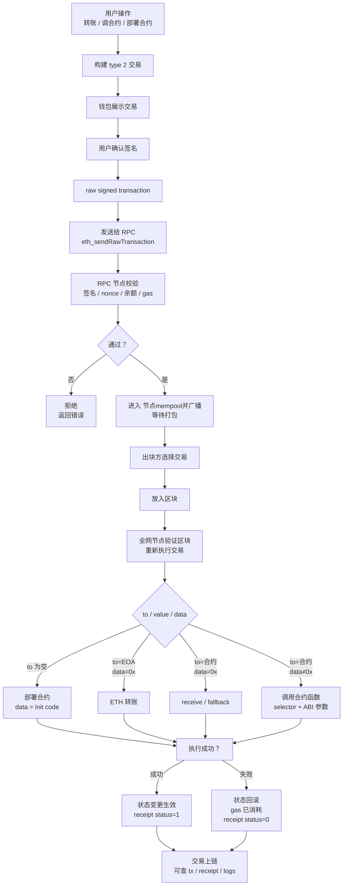

A note before reading: this article represents only the author's personal views.

========

As the account through which users interact with the real world and Web3, a wallet can be considered the gateway to exploring Web3—at least in my understanding. Based on this idea, this exploration focuses on the wallet itself and examines the basic actions a wallet can perform on-chain. Here is the project demo page: [https://evm-wallet.block.dreaifehebi.com/](https://evm-wallet.block.dreaifehebi.com/)

::github{repo="dreaifeHebi/evm-eoa-wallet-demo"}

# Wallet Creation and Its Scope of Actions

## Creating and Importing a Wallet

- Creating a wallet

	In general, any random number within \[1,n) can serve as a valid wallet private key. The public key obtained from d\*G is processed with keccak256 to derive a wallet address, which represents the existence of that private key on the blockchain. In other words, wallets theoretically already exist on the blockchain. Once you create a private key corresponding to one of these addresses, you can activate and use it as its owner—provided that nobody else is already using it.

	However, generating a wallet by creating a new random number each time is rather inconvenient, and remembering a random 16-digit large number is not exactly easy. Is there a simpler way to create multiple wallets following a consistent pattern while allowing all of them to be recovered at once using a single, memorable piece of information? This is where HD wallets—Hierarchical Deterministic Wallets—come in. They are also what we commonly refer to today as mnemonic wallets.

	They use BIP-39 to generate a mnemonic phrase and its seed, BIP-32 to derive the master key m from that seed, and finally BIP-44 to derive wallets in batches using a path in the format m/44‘/60’/acc‘/0/i.

- Recovering/importing a wallet

	For an ordinary wallet, you only need to remember the private key beginning with 0x to recover it—assuming you have an extraordinary memory.

	For the more commonly used HD wallet, frequently used addresses are recovered by following the derivation process described above. The process continues seamlessly from the mnemonic phrase generated through BIP-39.

## Verification and Transactions

If wallet actions are categorized according to whether they can directly change on-chain state, they can roughly be divided into verification and transactions.

- Verification

	As the name suggests, verification works as described in my previous blog post: the wallet signs an EIP-191 message, usually in SIWE format, allowing the service receiving the signature to verify ownership of the wallet.

	::site{url="https://dreaife.tokyo/evm-wallet-login/"}

	Of course, if a wallet could only perform simple operations such as signing messages, the range of things it could do would be rather limited. This led to the introduction of EIP-712.

	By defining a mutually understood set of signed fields, users can authorize a DApp or another service through a signature alone. That service can then initiate a transaction that calls an on-chain smart contract to execute the signed intent, making it more convenient for users to control their on-chain assets.

	There are also protocols such as EIP-7702 that give EOA wallets capabilities close to those of contract wallets. However, because the main focus here is ordinary EOA wallet functionality, I did not explore that topic in depth.

- Transactions

	A transaction is the basic mechanism through which a wallet actively changes on-chain state. It generally contains fields such as to｜value｜data｜nonce｜gas｜chainId. By controlling these fields, a wallet can initiate transactions that perform basic operations such as transferring funds, calling contracts, and deploying contracts.

# Creating an HD Wallet

This section explains how the most commonly used HD wallets generate mnemonic phrases for Ethereum wallets and derive up to $2^{31}*2^{31}$ possible wallet private keys—the $2^{31}$ possibilities from hardened account derivation multiplied by the $2^{31}$ possibilities from non-hardened address_index derivation.

## HD Wallet Private-Key Creation Process

The process from generating a mnemonic phrase to deriving a private key that can actually control a wallet address generally follows these steps:

- BIP-39 generates the mnemonic phrase and seed
- BIP-32 derives the master key m from the seed
- BIP-44 defines the m/44’/60’/account’/0/i derivation rule used by Ethereum, deterministically deriving a private key from account and i

Each step is explained in detail below.

## Generating the Mnemonic Phrase and Seed

Generating the mnemonic phrase:

- Generate random entropy

	When generating a mnemonic phrase, BIP-39 first generates a random number containing 128/160/192/224/256 bits.

	These sizes correspond to mnemonic phrases containing 12/15/18/21/24 words, respectively. Here, we use 256-bit entropy, which produces a 24-word mnemonic phrase, as an example.

- Calculate SHA-256 over the entropy to obtain a new 256-bit number
- Take a checksum of length ENT/32

	In other words, first calculate the checksum from the SHA-256 result, and then take the first ENT/32 bits of that checksum. For a 256-bit random number, this means taking the first 8 bits of the checksum.

- Concatenate the entropy and checksum to obtain a 256-bit + 8-bit, or 264-bit, number
- Divide this data into 11-bit groups, producing 264/11 = 24 groups; this is why 256-bit entropy corresponds to a 24-word mnemonic phrase
- For each group, select the corresponding word from the BIP-39 wordlist containing 2048 ($2^{11}$) words
- The resulting 24 words form the mnemonic phrase normally used by an HD wallet

Next comes the conversion from the mnemonic phrase to the seed.

PBKDF2-HMAC-SHA512 is used to calculate a 512-bit seed. The calculation is as follows:

$PBKDF2-HMAC-SHA512(password=mnemonic ,salt="mnemonic"+password,iteration=2048,dkLen=64bytes)$

The UTF-8 byte stream of the mnemonic phrase is used as the password, while the salt is “mnemonic” + password, and HMAC-SHA512 is performed for 2048 iterations. The first value, U1, is calculated from the mnemonic phrase, password, and block_index (U1=HMAC(password,salt \|\| INT(block_index))). Starting from U2, each HMAC-SHA512 operation uses the previously calculated $U_{i-1}$ as its input (U2=HMAC(password, U1)).

The final result for the first block is result = U1 xor U2 xor … xor U2048. Because the 512-bit output already matches the required length of 64 bytes, only one block is needed. This result is the seed generated according to BIP-39.

## Deriving the Master Key m

According to BIP-32, another HMAC-SHA512 operation is performed on the seed calculated above to obtain I:

$I = HMAC-SHA512(key = \text{``Bitcoin seed''}, data = seed)$

This produces a 512-bit value I. It can be divided into two 256-bit halves.

The left half, $I_L$, becomes the master private key, while the right half, $I_R$, becomes the master chain code.

Both are used in the subsequent BIP-44 derivation calculations.

## Deriving a Specific Private Key

Next, we look at how BIP-44 specifies the derivation of a particular private key from the master key along the m/44’/60’/account’/0/i path using BIP-32.

Because this starts to involve group operations on the secp256k1 elliptic curve, anyone unfamiliar with the fundamentals is welcome to read my previous explanation and proof (

::site{url="https://dreaife.tokyo/eoa-sign-verify/"}

- Derivation path m/44’/60’/account’/0/i

	First, let us explain what a derivation path actually is.

	A derivation path can be understood as a six-level tree rooted at the master key m, with $2^{32}$ possible indices at each level. In practice, only half of them—$2^{31}$ indices—are generally used. Whether an index is interpreted directly as i (\[0,$2^{31}$)) or as i‘=i+$2^{31}$ depends on the hardened marker ‘ displayed after the number at that level.

	The hardened marker also affects how child nodes are calculated.

	The five levels following m in 44’/60’/account’/0/i have the following meanings:

	- 44‘: the purpose defined by BIP-44
	- 60’: the coin type used for Ethereum
	- account‘: the account number selected during derivation
	- 0: the external chain, generally used for ordinary receiving addresses
	- i: the ith address under each account
- Non-hardened child-node calculation

	For the index i of a child node at a given level, the child value I can be calculated from the parent node's private key IL, referred to below as pPk, and its chain code IR, referred to below as pCc, using the following formula:

	$$
	
	$$

	Here, $serP(pPk*G)$ means 0x02/0x03 \|\| (pPk\*G)_x. pPk\*G is the parent node's public key, and whether 0x02 or 0x03 is used depends on whether the y or p-y value of the calculated parent public key (mod p) is odd or even.

	The resulting I is again divided into left and right 256-bit halves, IL and IR.

	The child private key is then (IL+parent private key) mod n.

	The child chain code is IR.

- Hardened child-node calculation

	For the index i’ of a child node at a given level, the child value I can be calculated from the parent node's private key IL, referred to below as pPk, and its chain code IR, referred to below as pCc, using the following formula:

	$$
	
	$$

	Here, 0x00 means that the private key pPk is used directly, so there is no longer any need to determine whether the public key's y coordinate is odd or even.

	The resulting I is again divided into left and right 256-bit halves, IL and IR.

	The child private key is then `(IL+parent private key) mod n`.

	The child chain code is `IR`.

- The resulting private key

	By deriving each level along m/44’/60’/account’/0/i, we eventually reach the leaf node at address_index i. The child private key calculated for this selected node is the private key d of that account address. Its actual account address can be obtained through the ordinary process of calculating d\*G, applying keccak256, and taking the final 20 bytes.

	The address can also be converted into a mixed-case address using the EIP-55 checksum. This validates the address format and helps detect formatting or input errors.

	> EIP-55 does not change the letters in an address. It only changes their capitalization according to the address's keccak256 result. If the character at position i is between a and f and the corresponding character in the keccak256 result is ≥8, it is converted to uppercase; otherwise, it remains unchanged.

# Wallet Transactions

A transaction can generally be divided into the transaction envelope and fee model required to put it on-chain, the key parameters to / value / data that make the transaction's behavior take effect, and verification parameters such as nonce/chainId.

## Transaction Structure

An ordinary EIP-1559/type 2 transaction has roughly the following internal structure:

```javascript
type: 0x02

chainId
nonce

maxPriorityFeePerGas
maxFeePerGas
gasLimit

to
value
data

accessList

signatureYParity
signatureR
signatureS
```

This is only a list of properties. An unsigned transaction generally resembles JSON more closely:

```javascript
{
  chainId: 1,
  nonce: 42,
  to: "0xContractOrEOA...",
  value: "1000000000000000000",
  data: "0x...",
  gasLimit: "21000",
  maxFeePerGas: "...",
  maxPriorityFeePerGas: "..."
}
```

After signing, it produces r/s/v values just like a verification signature, which are then appended to the end of the JSON shown above.

The transaction content and signature are then encoded into a byte sequence according to the following structure, producing a raw signed transaction. The encoded transaction can be sent to an RPC endpoint for broadcasting and eventual inclusion on-chain.

```javascript
0x02 || rlp([
  chainId,
  nonce,
  maxPriorityFeePerGas,
  maxFeePerGas,
  gasLimit,
  to,
  value,
  data,
  accessList,
  yParity,
  r,
  s
])
```

Each field has the following purpose:

- chainId: prevents the same transaction from being replayed on another chain
- nonce: the account's transaction sequence number, which prevents the same transaction from being executed repeatedly and determines transaction order. Note that this nonce belongs to the operating wallet on the current chain and must increment by 1 from the previous transaction's nonce
- to: the destination address; an empty value indicates contract deployment
- value: the amount of native currency sent with the transaction
- data/input: the calldata for a contract call, or the init code when deploying a contract
- gasLimit: the maximum amount of gas the transaction is allowed to consume
- maxFeePerGas: the highest per-gas price the user is willing to pay
- maxPriorityFeePerGas: the maximum tip paid to the validator/proposer
- signature: the EOA wallet's signature over the transaction content

## Fee Models

The fee models are generally divided into the following types:

<table>
<colgroup>
<col width="158.6640625">
<col width="182.6640625">
<col width="328.6640625">
</colgroup>
<tr>
<td>Type</td>
<td>Name</td>
<td>Key points</td>
</tr>
<tr>
<td>legacy / commonly called type 0</td>
<td>Legacy transaction</td>
<td>gasPrice + gasLimit, without a typed envelope</td>
</tr>
<tr>
<td>type 1</td>
<td>EIP-2930 access list</td>
<td>Legacy gasPrice fee model with an additional accessList</td>
</tr>
<tr>
<td>type 2</td>
<td>EIP-1559</td>
<td>maxFeePerGas + maxPriorityFeePerGas + gasLimit</td>
</tr>
<tr>
<td>type 3</td>
<td>EIP-4844 blob tx</td>
<td>Sends blob data for rollups, with additional maxFeePerBlobGas and blobVersionedHashes fields</td>
</tr>
<tr>
<td>type 4</td>
<td>EIP-7702 set-code tx</td>
<td>Allows an EOA to set delegation code through authorizationList, giving it capabilities close to those of a contract account</td>
</tr>
</table>

Because this article primarily considers the basic transactions commonly used today, the structure above is based on type 2 transactions.

## Transaction Lifecycle

A transaction is generally constructed and signed while interacting with an application or directly inside a wallet. The completed transaction is then sent to an RPC endpoint for broadcasting and inclusion on-chain. The approximate process is as follows:


```mermaid
flowchart TD
    A["用户操作<br/>转账 / 调合约 / 部署合约"] --> B["构建 type 2 交易"]

    B --> C["钱包展示交易"]
    C --> D["用户确认签名"]
    D --> F["raw signed transaction"]
    F --> G["发送给 RPC<br/>eth_sendRawTransaction"]

    G --> H["RPC 节点校验<br/>签名 / nonce / 余额 / gas"]
    H --> I{"通过？"}
    I -->|"否"| X["拒绝<br/>返回错误"]
    I -->|"是"| J["进入 节点mempool并广播<br/>等待打包"]

    J --> K["出块方选择交易"]
    K --> L["放入区块"]
    L --> M["全网节点验证区块<br/>重新执行交易"]

    M --> N{"to / value / data"}

    N -->|"to 为空"| O["部署合约<br/>data = init code"]
    N -->|"to=EOA<br/>data=0x"| P["ETH 转账"]
    N -->|"to=合约<br/>data=0x"| Q["receive / fallback"]
    N -->|"to=合约<br/>data≠0x"| R["调用合约函数<br/>selector + ABI 参数"]

    O --> S["执行成功？"]
    P --> S
    Q --> S
    R --> S

    S -->|"成功"| T["状态变更生效<br/>receipt status=1"]
    S -->|"失败"| U["状态回滚<br/>gas 已消耗<br/>receipt status=0"]

    T --> V["交易上链<br/>可查 tx / receipt / logs"]
    U --> V
```

# Wallet Verification

As mentioned in the introduction, in addition to transactions that are submitted directly on-chain, a wallet can also perform verification actions that do not go directly on-chain.

## Ordinary Wallet-Ownership Verification Using the SIWE Standard

This allows a wallet to prove to a service that the user controls it. For details, refer to the blog post linked above (

::site{url="https://dreaife.tokyo/evm-wallet-login/"}

## EIP-712: Verification That Can Authorize a Contract

EIP-712 is a form of authorization verification in which the signer agrees to the contents of an EIP-712 message. It resembles a transaction signature: the user signs parameters intended for a contract call, authorizing the contract—if it supports this kind of authorization—to operate assets belonging to the user. Of course, this is still only a signature. To make the signed content change on-chain state, the service must combine the signature and call data into a transaction and send it to the contract targeted by the signature.

- Signature content

	The signed content generally follows this format:

	```javascript
	{
	  types: {
	    EIP712Domain: [
	      { name: "name", type: "string" },
	      { name: "version", type: "string" },
	      { name: "chainId", type: "uint256" },
	      { name: "verifyingContract", type: "address" }
	    ],
	    Permit: [
	      { name: "owner", type: "address" },
	      { name: "spender", type: "address" },
	      { name: "value", type: "uint256" },
	      { name: "nonce", type: "uint256" },
	      { name: "deadline", type: "uint256" }
	    ]
	  },
	  primaryType: "Permit",
	  domain: {
	    name: "DemoToken",
	    version: "1",
	    chainId: 1,
	    verifyingContract: "0xTokenContract..."
	  },
	  message: {
	    owner: "0xUser...",
	    spender: "0xDappOrRouter...",
	    value: "1000000000000000000",
	    nonce: 0,
	    deadline: 1710000000
	  }
	}
	```

	Here, types defines the data structures; primaryType specifies the primary structure being signed, such as Permit, Order, Forward, or Request; domain defines the scope in which the signature is valid; and message contains the actual authorization granted by the user.

- The process from an EIP-712 signature to its use

	For example, with a Permit-style EIP-712 signature, the owner signs an authorization allowing the spender address to spend a specified value of tokens until the deadline, using nonce n. This authorization is returned to the DApp as a signature. The DApp then initiates a transaction containing the authorization and its data through permit( owner, spender, value, deadline, v, r, s). After the contract verifies that the signature matches the signed content, it applies the change specified by the authorization.

	The complete process is as follows:

	1. The protocol/contract first defines a signable structure<br>Permit(owner, spender, value, nonce, deadline)
	2. The DApp constructs the EIP-712 typed data<br>including types, domain, primaryType, and message
	3. The wallet displays the signature content<br>the user can see which DApp, chain, and contract are involved, as well as what is being authorized
	4. After the user confirms, the EOA private key signs it<br>the wallet calculates the digest:<br>keccak256("\\x19\\x01" \|\| domainSeparator \|\| hashStruct(message))<br>and then produces r/s/v
	5. The wallet returns the signature to the DApp/service<br>nothing has been submitted on-chain yet, no gas has been consumed, and no state has changed
	6. The DApp/relayer/another party constructs a transaction<br>passing the fields from message together with the signature to the contract
	7. The contract reconstructs the same digest on-chain<br>and uses ecrecover / ECDSA.recover to recover the signer
	8. The contract checks whether the signature is valid<br>whether signer equals owner<br>whether the nonce has not already been used<br>whether the deadline has not passed<br>whether chainId / verifyingContract / domain match
	9. Once the checks pass, the contract changes state<br>for example, setting an allowance, filling an order, or executing a meta-transaction
	10. The nonce is consumed<br>preventing the same signature from being reused

# Implementation in Code

The implementation primarily uses ethers.js for imports and calls. Honestly, this library feels really pleasant to use; all the bitwise operations made me feel like I was back in my programming-contest days lol.

## EOA/HD Wallets

For wallet creation, the current implementation follows the defaults used by mainstream wallets and the ethers library: it selects the first address under the first account. Specifically, it uses the path m/44‘/60’/0‘/0/0 and primarily relies on ethers' Wallet class—using createRandom to create a wallet, direct construction to import one, and HDNodeWallet.fromPhrase to import a mnemonic phrase.

```javascript
const DEFAULT_DERIVATION_PATH = "m/44'/60'/0'/0/0";

function createWallet() {
  const nextWallet = ethers.Wallet.createRandom();
  selectWallet(nextWallet, "Created wallet");
}

function importWallet() {
  const nextWallet = new ethers.Wallet(importKey.trim());
  selectWallet(nextWallet, "Imported wallet");
}

function importSeedPhrase() {
  const phrase = seedPhrase.trim().replace(/\s+/g, " ");
  const nextWallet = ethers.HDNodeWallet.fromPhrase(
    phrase,
    "",
    DEFAULT_DERIVATION_PATH
  );
  selectWallet(nextWallet, `Imported seed phrase at ${DEFAULT_DERIVATION_PATH}`);
}
```

## Ordinary EIP-191 Signatures

```javascript
function personalSignEnvelope(message: string) {
  const byteLength = ethers.toUtf8Bytes(message).length;
  return `0x19 || "Ethereum Signed Message:\n${byteLength}" || utf8(message)`;
}

async function signMessage() {
  const activeWallet = requireWallet();
  const nextSignature = await activeWallet.signMessage(message);
  setSignature(nextSignature);
}

function verifyMessage() {
  const recovered = ethers.verifyMessage(message, signature);
  const digest = ethers.hashMessage(message);
  setRecoveredAddress(recovered);
}
```

## EIP-712 Signatures

- Constructing and verifying the signature content

	```javascript
	const typedDomain = {
	  name: "EOA Wallet Lab",
	  version: "1",
	  chainId: BigInt(typedChainId || "1"),
	  verifyingContract: typedVerifier || ZERO_ADDRESS
	};

	const typedTypes = {
	  LoginRequest: [
	    { name: "owner", type: "address" },
	    { name: "statement", type: "string" },
	    { name: "nonce", type: "string" },
	    { name: "deadline", type: "uint256" }
	  ]
	};

	const typedValue = {
	  owner: wallet?.address || ZERO_ADDRESS,
	  statement: typedStatement,
	  nonce: typedNonce,
	  deadline: BigInt(typedDeadline || "0")
	};

	async function signTypedData() {
	  const activeWallet = requireWallet();
	  const nextSignature = await activeWallet.signTypedData(
	    typedDomain,
	    typedTypes,
	    typedValue
	  );
	  setTypedSignature(nextSignature);
	}

	function verifyTypedData() {
	  const recovered = ethers.verifyTypedData(
	    typedDomain,
	    typedTypes,
	    typedValue,
	    typedSignature
	  );
	  const digest = ethers.TypedDataEncoder.hash(typedDomain, typedTypes, typedValue);
	  setTypedRecovered(recovered);
	}
	```

- Constructing and signing a type 2 transaction

	```javascript
	function buildTxRequest(): ethers.TransactionRequest {
	  return {
	    type: 2,
	    to,
	    value: ethers.parseEther(txValue || "0"),
	    data,
	    chainId: BigInt(txChainId || "1"),
	    nonce: Number(txNonce || "0"),
	    gasLimit: BigInt(txGasLimit || "21000"),
	    maxFeePerGas: ethers.parseUnits(txMaxFee || "1", "gwei"),
	    maxPriorityFeePerGas: ethers.parseUnits(txPriorityFee || "1", "gwei")
	  };
	}

	async function signTransaction() {
	  const activeWallet = requireWallet();
	  const signed = await activeWallet.signTransaction(buildTxRequest());
	  const parsed = ethers.Transaction.from(signed);

	  setRawTx(signed);
	  setTxHash(parsed.hash || "");
	}

	function verifyRawTransaction() {
	  const parsed = ethers.Transaction.from(rawTx);
	  setTxHash(parsed.hash || "");
	  setTxSigner(parsed.from || "");
	}
	```

- Broadcasting a transaction

	```javascript
	async function broadcastTransaction() {
	  const signed = rawTx || (await requireWallet().signTransaction(buildTxRequest()));
	  const provider = new ethers.JsonRpcProvider(rpcUrl);
	  const parsed = ethers.Transaction.from(signed);

	  const response = await provider.broadcastTransaction(signed);

	  setRawTx(signed);
	  setTxHash(parsed.hash || response.hash);
	  setTxSigner(parsed.from || "");
	  setBroadcastHash(response.hash);

	  const receipt = await provider.waitForTransaction(response.hash, 1, 60_000);
	}
	```

# Summary

This blog post has provided a general overview, from the wallet's perspective, of today's commonly used HD wallets and the signature-verification and transaction operations they commonly perform both on-chain and off-chain.

Honestly, I had originally planned to understand the overall structure and write this around the 15th or 16th. However, I was suddenly overwhelmed by a strong urge to draw, so I spent more than four days creating my first painting and took a short break along the way XD. Fortunately, it also gave me another round of mental training and helped me see reality more clearly, so I suppose I still made some progress (
