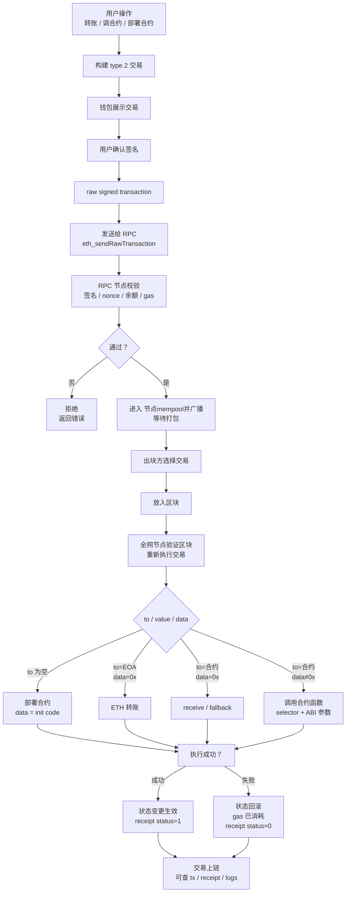

Before reading, please note that this article represents only the author's personal views.

========

As the account through which users interact with the real world and the web3 world, a wallet can arguably be considered a gateway to exploring web3—at least in my personal understanding. Based on this idea, this exploration focuses on wallets themselves and examines the basic actions a wallet can perform on-chain. Here is the project demo page: [https://evm-wallet.block.dreaifehebi.com/](https://evm-wallet.block.dreaifehebi.com/)

::github{repo="dreaifeHebi/evm-eoa-wallet-demo"}

# Wallet Creation and Its Scope of Actions

## Wallet Creation and Import

- Creating a wallet

	Generally speaking, any random number within \[1,n) can serve as a valid wallet private key. The wallet address calculated by applying keccak256 to the public key obtained from d\*G represents the wallet associated with that private key on the blockchain. In other words, the wallet theoretically already exists on the blockchain. Once you create a private key corresponding to that address, you can activate and use it as its owner, provided nobody else has already used it.

	However, having to generate a random number every time you want to create a wallet is rather inconvenient, and memorizing a random 16-digit large number is hardly practical. Is there a simpler way to create multiple wallets following a consistent pattern while allowing all of them to be restored at once using a single, easy-to-remember piece of information? This is where the HD wallet, or Hierarchical Deterministic Wallet, comes in. It is also what is commonly known today as a mnemonic wallet.

	It uses BIP-39 to generate a mnemonic phrase and its seed, derives m from the seed through BIP-32, and finally uses BIP-44 to generate wallets in bulk according to the m/44‘/60’/acc‘/0/i format.

- Restoring/importing a wallet

	For an ordinary wallet, you only need to remember the string of private-key characters beginning with 0x to restore it—assuming you have an extraordinary memory.

	For the more commonly used HD wallet, frequently used addresses are restored by following the derivation process described above. The process can continue seamlessly after generating the mnemonic phrase through BIP-39.

## Verification and Transactions

If wallet-initiated actions are categorized according to whether they can directly change on-chain state, they can roughly be divided into verification and transactions.

- Verification

	Verification, as the name suggests and as described in a previous blog post, involves signing an EIP-191 message—usually in SIWE format—so that the service receiving the signature can verify ownership of the wallet.

	::site{url="https://dreaife.tokyo/evm-wallet-login/"}

	Of course, if a wallet could only perform simple operations such as signing messages, its capabilities would be far too limited. This is why EIP-712 was introduced.

	By defining a commonly agreed-upon set of signed fields, users can authorize a DApp or another service through a signature alone to initiate a transaction and invoke an on-chain smart contract that executes the signed instructions. This allows users to control their on-chain assets more conveniently.

	There are also protocols such as EIP-7702 that give EOA wallets capabilities similar to contract wallets. However, since the main focus here is on EOA wallets, I did not explore that topic in depth.

- Transactions

	A transaction is the basic way for a wallet to actively change on-chain state. It usually contains fields such as to｜value｜data｜nonce｜gas｜chainId. By controlling these fields, a wallet can initiate transactions that perform basic operations such as transferring assets, calling contracts, and deploying contracts.

# Creating an HD Wallet

This section explains how the most commonly used type of wallet today—the HD wallet—generates a mnemonic phrase for an Ethereum wallet and derives from it $2^{31}*2^{31}$ possible wallet private keys—the $2^{31}$ possibilities from hardened account derivation multiplied by the $2^{31}$ possibilities from non-hardened address_index derivation.

## HD Wallet Private-Key Creation Process

The process from generating a mnemonic phrase to deriving a private key that can actually control a wallet address generally follows these steps:

- BIP-39 generates the mnemonic phrase and seed
- BIP-32 derives the master key m from the seed
- BIP-44 specifies a derivation rule for Ethereum in the form m/44’/60’/account’/0/i, deterministically deriving a private key from account and i

Each step is described in detail below.

## Generating the Mnemonic Phrase and Seed

Generating the mnemonic phrase

- Generate random entropy

	When BIP-39 generates a mnemonic phrase, it first generates a random number of 128, 160, 192, 224, or 256 bits.

	These correspond to mnemonic phrases containing 12, 15, 18, 21, or 24 words, respectively. Here, we use 256-bit entropy, which produces a 24-word mnemonic phrase, as an example.

- Apply SHA-256 to the entropy to obtain a new 256-bit number
- Take a checksum of length ENT/32

	In other words, first calculate the checksum of the SHA-256 result, and then take the first ENT/32 bits of that checksum. For a 256-bit random number, this means taking the first 8 bits of the checksum.

- Concatenate the entropy and checksum to obtain a 256-bit + 8-bit, or 264-bit, number
- Divide this data into 11-bit groups, producing 264/11 = 24 groups, which is why 256-bit entropy corresponds to a 24-word mnemonic phrase
- For each group, select the corresponding word from the BIP-39 wordlist containing 2048 ($2^{11}$) words
- The resulting 24 words form the mnemonic phrase commonly used in an HD wallet

Next comes the generation of the seed from the mnemonic phrase.

A 512-bit seed is calculated using PBKDF2-HMAC-SHA512. The specific calculation is as follows:

$PBKDF2-HMAC-SHA512(password=mnemonic ,salt="mnemonic"+password,iteration=2048,dkLen=64bytes)$

The mnemonic phrase, converted into a UTF-8 byte stream, is used as the password. The salt is “mnemonic” + password, and HMAC-SHA512 is performed for 2048 iterations. The first value, U1, is calculated from the mnemonic phrase, password, and block_index (U1=HMAC(password,salt \|\| INT(block_index))). Starting with U2, each HMAC-SHA512 calculation uses the previously calculated $U_{i-1}$ as its key (U2=HMAC(password, U1)).

The final result for the first block is therefore result = U1 xor U2 xor … xor U2048. Because the 512-bit output already matches the required length of 64 bytes, only one block is needed. The resulting output is the seed generated according to BIP-39.

## Deriving the Master Key m

According to BIP-32, another round of HMAC-SHA512 is applied to the seed calculated above to obtain I, as follows:

$I = HMAC-SHA512(key = \text{``Bitcoin seed''}, data = seed)$

This produces a 512-bit value I, which can be divided into two 256-bit halves.

The left half, $I_L$, serves as the master private key, while the right half, $I_R$, serves as the master chain code.

They are used in the next step of the BIP-44 derivation calculation.

## Deriving a Specific Key

Next, we examine how BIP-44 specifies the derivation of a particular key from the master key along the m/44’/60’/account’/0/i path using BIP-32.

Since this begins to involve group operations on the secp256k1 elliptic curve, readers unfamiliar with the fundamentals are welcome to refer to my previous explanation and proof of the underlying principles (

::site{url="https://dreaife.tokyo/eoa-sign-verify/"}

- Derivation path m/44’/60’/account’/0/i

	First, let us explain what a derivation path actually is.

	A derivation path can be understood as a tree rooted at the master key m with a depth of six levels, where each level contains $2^{32}$ possible values. However, only half of those values—$2^{31}$—are generally used. Whether the number i at a given level is used directly as i (\[0,$2^{31}$)) or as i‘=i+$2^{31}$ is determined by whether the apostrophe in the upper-right corner marks that level as hardened.

	The hardened marker also affects the method used to derive child nodes.

	For the five levels following m—44’/60’/account’/0/i—the meaning of each level is:

	- 44‘: The purpose specified by BIP-44
	- 60’: The coin type used for Ethereum
	- account‘: The account number selected during derivation
	- 0: The external chain, generally used for ordinary receiving addresses
	- i: The ith address for each account
- Non-hardened child-node calculation

	For the number i of a child node at a given level, the child node's I can be calculated from the parent node's private key IL, referred to below as pPk, and chain code IR, referred to below as pCc, using the following equation:

	$$
	
	$$

	Here, $serP(pPk*G)$ means 0x02/0x03 \|\| (pPk\*G)_x. pPk\*G is the parent node's public key, and whether 0x02 or 0x03 is used depends on whether the calculated parent public key's y or p-y value modulo p is odd or even.

	The resulting I is likewise divided into left and right halves, IL and IR, each 256 bits long.

	The child private key of this child node is (IL+parent private key) mod n.

	The child chain code is IR.

- Hardened child-node calculation

	For the number i’ of a child node at a given level, the child node's I can be calculated from the parent node's private key IL, referred to below as pPk, and chain code IR, referred to below as pCc, using the following equation:

	$$
	
	$$

	Here, 0x00 means that the private key pPk is used directly, so there is no longer any need to determine the parity of the public key's y-coordinate.

	The resulting I is likewise divided into left and right halves, IL and IR, each 256 bits long.

	The child private key of this child node is `(IL+parent private key) mod n`.

	The child chain code is `IR`.

- The final private key

	By deriving one level at a time along m/44’/60’/account’/0/i, the process eventually reaches the leaf node at address_index i. The child private key calculated for this selected node is the private key d for that account address. Its actual account address can be obtained by applying the usual keccak256 calculation to the private key's public key d\*G and taking the last 20 bytes.

	The address can also be converted from a regular address into a mixed-case address using the EIP-55 checksum. This makes it possible to verify that the address format is valid and detect string-format or input errors.

	> EIP-55 does not change the letters in an address; it only changes their capitalization according to the keccak256 result of that address. If the character at position i in the address is a-f and the corresponding character at position i in the keccak256 result is ≥8, it is capitalized. Otherwise, it remains unchanged.

# Wallet Transactions

A transaction can generally be divided into the transaction envelope and fee model that allow it to be included on-chain; the key parameters to, value, and data that make the transaction's intended behavior take effect; and validation parameters such as nonce and chainId.

## Transaction Structure

The internal structure of an ordinary EIP-1559/type 2 transaction is roughly as follows:

```javascript
type: 0x02

chainId
nonce

maxPriorityFeePerGas
maxFeePerGas
gasLimit

to
value
data

accessList

signatureYParity
signatureR
signatureS
```

This is only a list of properties. An unsigned transaction generally looks more like JSON:

```javascript
{
  chainId: 1,
  nonce: 42,
  to: "0xContractOrEOA...",
  value: "1000000000000000000",
  data: "0x...",
  gasLimit: "21000",
  maxFeePerGas: "...",
  maxPriorityFeePerGas: "..."
}
```

After signing, r/s/v values are produced just as they are when signing for verification, and they are appended to the end of the JSON above.

The transaction contents and signature are then encoded into a byte string according to the following structure, producing a raw signed transaction. The encoded transaction can then be sent to an RPC endpoint for broadcasting and eventual inclusion on-chain.

```javascript
0x02 || rlp([
  chainId,
  nonce,
  maxPriorityFeePerGas,
  maxFeePerGas,
  gasLimit,
  to,
  value,
  data,
  accessList,
  yParity,
  r,
  s
])
```

Each field serves the following purpose:

- chainId: Prevents the same transaction from being replayed on another chain
- nonce: The account's transaction sequence number. It prevents the same transaction from being executed repeatedly and also determines transaction order. Note that this nonce belongs to the operating wallet on the current chain, and each new transaction's nonce must increase by 1 from the previous transaction's nonce
- to: The destination address; if empty, the transaction deploys a contract
- value: The amount of native currency sent with the transaction
- data/input: The calldata for a contract call, or the init code when deploying a contract
- gasLimit: The maximum amount of gas that the transaction is allowed to consume
- maxFeePerGas: The maximum price per unit of gas the user is willing to pay
- maxPriorityFeePerGas: The maximum tip paid to the validator/proposer
- signature: The EOA wallet's signature over the transaction contents

## Fee Models

The fee models can generally be divided into the following types:

<table>
<colgroup>
<col width="158.6640625">
<col width="182.6640625">
<col width="328.6640625">
</colgroup>
<tr>
<td>Type</td>
<td>Name</td>
<td>Key Point</td>
</tr>
<tr>
<td>legacy / commonly called type 0</td>
<td>Legacy transaction</td>
<td>gasPrice + gasLimit, without a typed envelope</td>
</tr>
<tr>
<td>type 1</td>
<td>EIP-2930 access list</td>
<td>Legacy gasPrice fee model, with an additional accessList</td>
</tr>
<tr>
<td>type 2</td>
<td>EIP-1559</td>
<td>maxFeePerGas + maxPriorityFeePerGas + gasLimit</td>
</tr>
<tr>
<td>type 3</td>
<td>EIP-4844 blob tx</td>
<td>Sends blob data to a rollup, with additional maxFeePerBlobGas and blobVersionedHashes fields</td>
</tr>
<tr>
<td>type 4</td>
<td>EIP-7702 set-code tx</td>
<td>Allows an EOA to set delegation code through authorizationList, giving it capabilities similar to a contract account</td>
</tr>
</table>

Since the main focus here is on basic transactions that are commonly used today, the structure above is based on type 2.

## The Lifecycle of a Transaction

A transaction is generally constructed and signed while invoking an application or within a wallet. The completed transaction is then sent to an RPC endpoint, which broadcasts it for inclusion on-chain. The overall process is roughly as follows:


```mermaid
flowchart TD
    A["用户操作<br/>转账 / 调合约 / 部署合约"] --> B["构建 type 2 交易"]

    B --> C["钱包展示交易"]
    C --> D["用户确认签名"]
    D --> F["raw signed transaction"]
    F --> G["发送给 RPC<br/>eth_sendRawTransaction"]

    G --> H["RPC 节点校验<br/>签名 / nonce / 余额 / gas"]
    H --> I{"通过？"}
    I -->|"否"| X["拒绝<br/>返回错误"]
    I -->|"是"| J["进入 节点mempool并广播<br/>等待打包"]

    J --> K["出块方选择交易"]
    K --> L["放入区块"]
    L --> M["全网节点验证区块<br/>重新执行交易"]

    M --> N{"to / value / data"}

    N -->|"to 为空"| O["部署合约<br/>data = init code"]
    N -->|"to=EOA<br/>data=0x"| P["ETH 转账"]
    N -->|"to=合约<br/>data=0x"| Q["receive / fallback"]
    N -->|"to=合约<br/>data≠0x"| R["调用合约函数<br/>selector + ABI 参数"]

    O --> S["执行成功？"]
    P --> S
    Q --> S
    R --> S

    S -->|"成功"| T["状态变更生效<br/>receipt status=1"]
    S -->|"失败"| U["状态回滚<br/>gas 已消耗<br/>receipt status=0"]

    T --> V["交易上链<br/>可查 tx / receipt / logs"]
    U --> V
```

# Wallet Verification

As mentioned in the introduction, besides transactions that can be submitted directly on-chain, wallets can also perform verification actions that do not directly go on-chain.

## Standard Wallet Ownership Verification with SIWE

This is how a wallet proves to a service that the user controls it. For details, refer to the blog post linked above (

::site{url="https://dreaife.tokyo/evm-wallet-login/"}

## EIP-712: Verification That Can Authorize Contracts

EIP-712 is a form of authorization verification through which the signer expresses consent to the signed EIP-712 contents. It is more similar to the signature in a transaction: the user signs parameters intended for a contract call, allowing the contract—if it supports this type of authorization—to operate on assets belonging to the user. Of course, it is still only a signature. To make the signed content change on-chain state, the service must combine the signature with the call data into a transaction and submit it to the contract targeted by the signature.

- Signature contents

	The signed content generally follows this format:

	```javascript
	{
	  types: {
	    EIP712Domain: [
	      { name: "name", type: "string" },
	      { name: "version", type: "string" },
	      { name: "chainId", type: "uint256" },
	      { name: "verifyingContract", type: "address" }
	    ],
	    Permit: [
	      { name: "owner", type: "address" },
	      { name: "spender", type: "address" },
	      { name: "value", type: "uint256" },
	      { name: "nonce", type: "uint256" },
	      { name: "deadline", type: "uint256" }
	    ]
	  },
	  primaryType: "Permit",
	  domain: {
	    name: "DemoToken",
	    version: "1",
	    chainId: 1,
	    verifyingContract: "0xTokenContract..."
	  },
	  message: {
	    owner: "0xUser...",
	    spender: "0xDappOrRouter...",
	    value: "1000000000000000000",
	    nonce: 0,
	    deadline: 1710000000
	  }
	}
	```

	Here, types defines the data structures; primaryType specifies the primary structure being signed, such as Permit, Order, Forward, or Request; domain defines the scope in which the signature applies; and message contains the content that the user actually authorizes.

- The process from creating to using an EIP-712 signature

	For example, with a Permit-type EIP-712 signature, the owner signs an authorization allowing the spender address to spend value tokens until the deadline, using nonce n. This authorization is returned to the DApp as a signature. The DApp then initiates a transaction using the authorization and its contents: permit( owner, spender, value, deadline, v, r, s). After the contract verifies that the signature matches the signed content, it applies the changes specified by the authorization.

	The specific process is as follows:

	1. The protocol/contract first defines the signable structure<br>Permit(owner, spender, value, nonce, deadline)
	2. The DApp constructs the EIP-712 typed data<br>Including types, domain, primaryType, and message
	3. The wallet displays the signature contents<br>The user can see which DApp, chain, and contract are involved, as well as what is being authorized
	4. After the user confirms, the EOA private key signs the data<br>The wallet calculates the digest:<br>keccak256("\\x19\\x01" \|\| domainSeparator \|\| hashStruct(message))<br>It then produces r/s/v
	5. The wallet returns the signature to the DApp/service<br>At this point, nothing has gone on-chain, no gas has been consumed, and no state has changed
	6. The DApp/relayer/another party constructs a transaction<br>It passes the fields in message together with the signature to the contract
	7. The contract reconstructs the same digest on-chain<br>It then recovers the signer using ecrecover / ECDSA.recover
	8. The contract checks whether the signature is valid<br>Whether signer equals owner<br>Whether nonce has not been used<br>Whether deadline has not expired<br>Whether chainId / verifyingContract / domain match
	9. After the checks pass, the contract executes the state change<br>For example, setting an allowance, filling an order, or executing a meta transaction
	10. The nonce is consumed<br>This prevents the same signature from being reused

# Implementation in Code

This implementation primarily uses ethers.js for imports and calls. To be honest, this library is genuinely pleasant to work with—all the bitwise operations make me feel like I am back in my competitive programming days, lol.

## EOA/HD Wallet

For wallet creation, the current implementation follows the default behavior of mainstream wallets and the ethers library by using the first address under the first account. The implementation is shown below. It uses the path m/44‘/60’/0‘/0/0 and primarily relies on ethers Wallet methods: createRandom for creation and direct new/HDNodeWallet.fromPhrase calls for importing.

```javascript
const DEFAULT_DERIVATION_PATH = "m/44'/60'/0'/0/0";

function createWallet() {
  const nextWallet = ethers.Wallet.createRandom();
  selectWallet(nextWallet, "Created wallet");
}

function importWallet() {
  const nextWallet = new ethers.Wallet(importKey.trim());
  selectWallet(nextWallet, "Imported wallet");
}

function importSeedPhrase() {
  const phrase = seedPhrase.trim().replace(/\s+/g, " ");
  const nextWallet = ethers.HDNodeWallet.fromPhrase(
    phrase,
    "",
    DEFAULT_DERIVATION_PATH
  );
  selectWallet(nextWallet, `Imported seed phrase at ${DEFAULT_DERIVATION_PATH}`);
}
```

## Ordinary EIP-191 Signatures

```javascript
function personalSignEnvelope(message: string) {
  const byteLength = ethers.toUtf8Bytes(message).length;
  return `0x19 || "Ethereum Signed Message:\n${byteLength}" || utf8(message)`;
}

async function signMessage() {
  const activeWallet = requireWallet();
  const nextSignature = await activeWallet.signMessage(message);
  setSignature(nextSignature);
}

function verifyMessage() {
  const recovered = ethers.verifyMessage(message, signature);
  const digest = ethers.hashMessage(message);
  setRecoveredAddress(recovered);
}
```

## EIP-712 Signatures

- Constructing and verifying the signed content

	```javascript
	const typedDomain = {
	  name: "EOA Wallet Lab",
	  version: "1",
	  chainId: BigInt(typedChainId || "1"),
	  verifyingContract: typedVerifier || ZERO_ADDRESS
	};

	const typedTypes = {
	  LoginRequest: [
	    { name: "owner", type: "address" },
	    { name: "statement", type: "string" },
	    { name: "nonce", type: "string" },
	    { name: "deadline", type: "uint256" }
	  ]
	};

	const typedValue = {
	  owner: wallet?.address || ZERO_ADDRESS,
	  statement: typedStatement,
	  nonce: typedNonce,
	  deadline: BigInt(typedDeadline || "0")
	};

	async function signTypedData() {
	  const activeWallet = requireWallet();
	  const nextSignature = await activeWallet.signTypedData(
	    typedDomain,
	    typedTypes,
	    typedValue
	  );
	  setTypedSignature(nextSignature);
	}

	function verifyTypedData() {
	  const recovered = ethers.verifyTypedData(
	    typedDomain,
	    typedTypes,
	    typedValue,
	    typedSignature
	  );
	  const digest = ethers.TypedDataEncoder.hash(typedDomain, typedTypes, typedValue);
	  setTypedRecovered(recovered);
	}
	```

- Constructing and signing a type 2 transaction

	```javascript
	function buildTxRequest(): ethers.TransactionRequest {
	  return {
	    type: 2,
	    to,
	    value: ethers.parseEther(txValue || "0"),
	    data,
	    chainId: BigInt(txChainId || "1"),
	    nonce: Number(txNonce || "0"),
	    gasLimit: BigInt(txGasLimit || "21000"),
	    maxFeePerGas: ethers.parseUnits(txMaxFee || "1", "gwei"),
	    maxPriorityFeePerGas: ethers.parseUnits(txPriorityFee || "1", "gwei")
	  };
	}

	async function signTransaction() {
	  const activeWallet = requireWallet();
	  const signed = await activeWallet.signTransaction(buildTxRequest());
	  const parsed = ethers.Transaction.from(signed);

	  setRawTx(signed);
	  setTxHash(parsed.hash || "");
	}

	function verifyRawTransaction() {
	  const parsed = ethers.Transaction.from(rawTx);
	  setTxHash(parsed.hash || "");
	  setTxSigner(parsed.from || "");
	}
	```

- Broadcasting the transaction

	```javascript
	async function broadcastTransaction() {
	  const signed = rawTx || (await requireWallet().signTransaction(buildTxRequest()));
	  const provider = new ethers.JsonRpcProvider(rpcUrl);
	  const parsed = ethers.Transaction.from(signed);

	  const response = await provider.broadcastTransaction(signed);

	  setRawTx(signed);
	  setTxHash(parsed.hash || response.hash);
	  setTxSigner(parsed.from || "");
	  setBroadcastHash(response.hash);

	  const receipt = await provider.waitForTransaction(response.hash, 1, 60_000);
	}
	```

# Summary

This blog post has roughly reviewed today's commonly used HD wallets from a wallet-centric perspective, along with the signature verification and transaction mechanisms they commonly use both on-chain and off-chain.

To be honest, I originally planned to have the overall structure figured out and start writing around the 15th or 16th. However, I was suddenly struck by a strong urge to draw, so I spent more than four days creating my first painting and took a bit of a break along the way XD. Fortunately, the experience gave me another round of mental training, and I suppose gaining a clearer view of reality counts as progress too (
