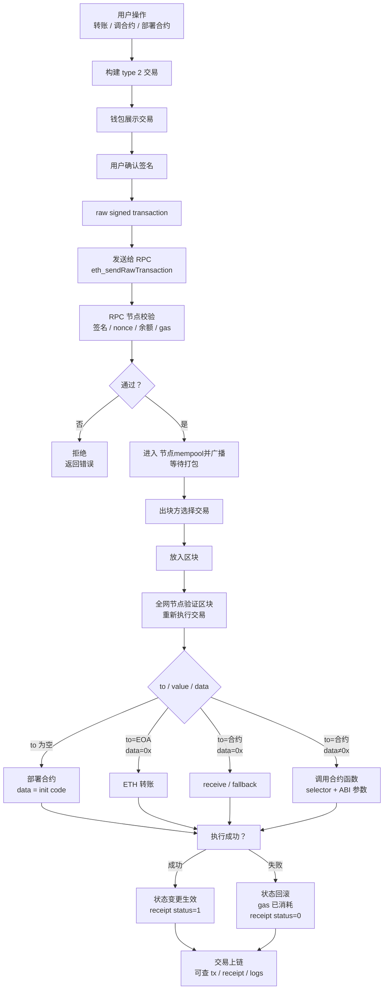

読前の注意として、この記事は作者個人の見解のみを示すものです。


========


ウォレットは、ユーザーが現実世界と web3 の世界を実際にやり取りする際に経由するアカウントであり、web3 を探索するための入口だと言えると思います（個人的な理解では）。そのため、今回の探索内容もこの認識をもとに、ウォレットを主体として、1つのウォレットがオンチェーンで実行できる基本的な行動を重点的に調べました。プロジェクトのデモページはこちらです：[https://evm-wallet.block.dreaifehebi.com/](https://evm-wallet.block.dreaifehebi.com/)


::github{repo="dreaifeHebi/evm-eoa-wallet-demo"}


# ウォレットの作成とその行動範囲


## ウォレットの作成とインポート

- ウォレットの作成

    一般的には、[1,n) に含まれる乱数を作成すれば、それは有効なウォレット秘密鍵と見なせます。そしてこの秘密鍵 d*G から得られる公開鍵を keccak256 で計算して得られるウォレットアドレスが、この秘密鍵の存在に対応する blockchain 上のウォレットになります。言い換えると、理論上ウォレットは常に blockchain 上に存在しており、そのアドレスに対応する秘密鍵を作成した時点で、あなたはその owner としてそれを有効化し利用できるようになります（他の人に使われていない場合）。


    ただし、毎回わざわざ乱数を作成してウォレットを生成するのは少し面倒ですし、ランダムな16進の大きな数を覚えるのも現実的ではありません。では、より簡単に、一定の規則に従った複数のウォレットをまとめて作成でき、復元時には覚えやすい共通の内容だけで一括復元できる方法はないのでしょうか。これが HD ウォレット（Hierarchical Deterministic Wallet）、あるいは現在最もよく使われているニーモニックウォレットです。


    これは BIP-39 によってニーモニックとその seed を生成し、BIP-32 によって seed から m を派生し、最後に BIP-44 に従って m/44‘/60’/acc‘/0/i の形式でウォレットを一括計算して生成します。

- ウォレットの復元/インポート

    通常のウォレットであれば、0x から始まるあの秘密鍵文字列を覚えていれば復元できます（驚異的な記憶力があれば）。


    より一般的な HD wallet では、上記の派生フローをたどることで、いくつかのよく使われるアドレスを復元します。具体的な手順は、BIP-39 でニーモニックを生成した後からそのまま接続できます。


## 検証とトランザクション


ウォレットが起こす行動を、それがオンチェーン状態を直接変更できるかどうかで分けるなら、おおよそ検証とトランザクションの2種類に分けられます。

- 検証

    検証は文字どおり、以前の blog でも述べたように、EIP-191 のフィールド（一般には SIWE 形式）に署名し、その署名を受け取ったサービス側にウォレットの所有権を検証させるものです。


    ::site{url="https://dreaife.tokyo/evm-wallet-login/"}


    もちろん、ウォレットが署名のような単純な操作しかできないのであれば、ウォレットでできることはあまりにも少なくなります。そこで EIP-712 が登場しました。


    合意された署名フィールドを定義することで、ユーザーは署名するだけで DApp やその他のサービスに対し、オンチェーンのスマートコントラクトを呼び出すトランザクションを発行して署名内容を実行する権限を与えられます。これにより、ユーザーはオンチェーン資産をより便利に制御できます。


    もちろん、EIP-7702 のように EOA ウォレットへコントラクトウォレットに近い能力を持たせるプロトコルもありますが、ここでは主に EOA ウォレット関連を考えるため、深くは扱いません。

- トランザクション

    トランザクションは、ウォレットがオンチェーン状態を能動的に変更する基本的な方法です。通常は to｜value｜data｜nonce｜gas｜chainId といった基本内容を含みます。これらのフィールド内容を制御することで、ウォレットが発行するトランザクションは、送金、コントラクト呼び出し、コントラクトデプロイなどの基本操作を実行できます。


# HD ウォレットの作成


ここからは、現在最もよく使われている HD ウォレットについて、ETH チェーン上のウォレットがどのようにニーモニックを生成し、そこから $2^{31}*2^{31} $（account hardened 派生の $2^{31}$ 通りの可能性 * address_index non-hardened 派生の $2^{31}$ 通りの可能性）のウォレット秘密鍵を派生できるのかを紹介します。


## HD ウォレットの秘密鍵作成フロー


ニーモニックの生成から、実際にウォレットアドレスを制御できる秘密鍵を派生するまでの一連の流れは、一般に次のようになります。

- BIP-39 でニーモニックと seed を生成する
- BIP-32 で seed からマスター鍵 m を派生する
- BIP-44 では Ethereum で使われる m/44’/60’/account’/0/i という派生ルールに従い、account と i によって決定論的に秘密鍵を派生する

以下、それぞれの手順を詳しく紹介します。


## ニーモニックと seed の生成


ニーモニックの生成

- ランダムエントロピー entropy を生成する

    BIP-39 でニーモニックを生成する際、まず 128/160/192/224/256 bit の乱数を生成します。


    それぞれ 12語/15語/18語/21語/24語のニーモニックに対応します。ここでは 256bit entropy、つまり24語のニーモニック生成を例にします。

- entropy に対して SHA-256 を計算し、新しい 256bit の数を得る
- 長さ ENT/32 の checksum を取る

    言い換えると、まず SHA-256 計算後のデータから checksum を計算し、その checksum 結果の先頭から ENT/32 の長さ分を取ります。256bit の乱数の場合、checksum の先頭 8bit を取ることになります。

- entropy と checksum を連結し、256bit+8bit、つまり 264bit の数を得る
- ここでこのデータを 11bit ごとに分割すると、264/11 = 24 グループになります。これが 256bit が24語のニーモニックに対応する理由です
- その後、各グループについて、2048（$2^{11}$）個の BIP-39 wordlist から対応する word を選びます
- この時点で得られた24個の word が、一般に HD ウォレットで使われるニーモニックです

次に、ニーモニックから seed を生成します。


ここでは PBKDF2-HMAC-SHA512 によって 512bit の seed を計算します。具体的な計算は次のとおりです。


$PBKDF2-HMAC-SHA512(password=mnemonic ,salt="mnemonic"+password,iteration=2048,dkLen=64bytes)$


つまり、utf8 byte stream 化したニーモニックを password とし、salt を “mnemonic”+password として、HMAC-SHA512 を iteration=2048 回実行します。最初の U1 は、ニーモニックと password、および block_index によって計算されます（U1=HMAC(password,salt || INT(block_index))）。その後の U2 以降は、前回計算された $U_{i-1}$ を key として HMAC-SHA512 を計算します（U2=HMAC(password, U1)）。


これにより最終的に計算される最初の block の result = U1 xor U2 xor … xor U2048 となります。512bit の出力が要求長である 64byte に一致するため、block は1つだけです。このとき出力される result が、BIP-39 の規則に従って生成された seed になります。


## マスター鍵 m の派生


BIP-32 によると、上で計算した seed に対してもう一度 HMAC-SHA512 を実行して I を得ます。具体的には次のとおりです。


$I = HMAC-SHA512(key = \text{``Bitcoin seed''}, data = seed)
$


この時点で 512bit の I が得られます。256bit の長さに従って、これを左右2つの 256bit の数に分割できます。


左側の $I_L$ は master private key として、右側の $I_R$ は master chain code として使われます。


これらは次の BIP-44 の派生計算で使用されます。


## 特定の鍵の派生計算


次は、BIP-44 がどのようにマスター鍵から m/44’/60’/account’/0/i のパスに沿って、BIP-32 により特定の鍵を計算するよう定めているかです。


ここから secp256k1 楕円曲線の群演算の範囲に入るため、基礎知識がない場合は、以前書いた原理の証明もぜひ見てください（


::site{url="https://dreaife.tokyo/eoa-sign-verify/"}

- 派生パス m/44’/60’/account’/0/i

    まず、派生パスとは何かを紹介します。


    派生パスは、マスター鍵 m をルートノードとする深さ6層の数として理解できます。各層は $2^{32}$ の数です。ただし、この $2^{32}$ の数については、一般にはその半分、つまり $2^{31}$ の数だけを使用します。これは各層の数字の右上にある ‘ が hardened かどうかによって、その層の数字 i を単に i（[0,$2^{31}$)）として使うのか、それとも i‘=i+$2^{31}$ として使うのかが決まるためです。


    同時に、この hardened マークは子ノードを計算する際の計算方式にも影響します。


    m の後ろにある 44’/60’/account’/0/i の5層の意味は、それぞれ次のとおりです。

    - 44‘：BIP-44 で規定された目的
    - 60’：Ethereum で使われる coin type
    - account‘：派生時に選択するアカウント番号
    - 0：external chain、一般に通常の受取アドレスに使われる
    - i：各アカウントにおける i 番目のアドレス
- non-hardened 子ノードの計算方式

    ある層の子ノードの数字 i について、親ノードの秘密鍵 IL（以下 pPk）と chainCode IR（以下 pCc）を使い、次の式で子ノードの I を計算できます。


    $$
    I = HMAC-SHA512(key=pCc,data=(serP(pPk*G) || ser32(i))
    $$


    ここで、$serP(pPk*G)$ は 0x02/0x03 || (pPk*G)_x を意味します。pPk*G は親ノードの公開鍵であり、0x02 か 0x03 かは、計算された親ノード公開鍵（mod p）の y/p-y が奇数か偶数かによって決まります。


    得られた I についても同様に、256bit の長さに従って左右の IL と IR に分割します。


    その子ノードの秘密鍵 child private key は (IL+parent private key) mod n になります。


    子ノードの child chain code は IR になります。

- hardened 子ノードの計算方式

    ある層の子ノードの数字 i’ について、親ノードの秘密鍵 IL（以下 pPk）と chainCode IR（以下 pCc）を使い、次の式で子ノードの I を計算できます。


    $$
    I = HMAC-SHA512(key=pCc,password=(0x00 || ser256(pPk) || ser32(i + 2^{31}))
    $$


    ここで 0x00 は秘密鍵 pPk を直接使用することを意味するため、公開鍵の y の奇偶を判断する必要はありません。


    得られた I についても同様に、256bit の長さに従って左右の IL と IR に分割します。


    その子ノードの秘密鍵 child private key は `(IL+parent private key) mod n` になります。


    子ノードの child chain code は `IR` になります。

- 最終的に得られる秘密鍵

    m/44’/60’/account’/0/i に従って層を1つずつ派生していき、最終的に address_index i のリーフノードに到達します。この選択されたノード上で計算されるその子ノードの child private key が、そのアカウントアドレスの秘密鍵 d です。実際のアカウントアドレスは、通常どおり秘密鍵 d*G を keccak256 で計算し、後ろ20byte を取ることで得られます。


    同時に、このアドレスについては、EIP-55 の checksum によって通常のアドレスを大文字小文字混在のアドレスに変換し、アドレス形式の正当性（文字列形式/入力ミスのチェック）を保証する方法があります。

    > EIP-55 は、アドレス内の文字自体は変更せず、そのアドレスの keccak256 計算結果に基づいて大文字小文字だけを変更する方式です。i 番目の文字が a-f の場合、その keccak256 計算結果に対応する i 番目が 8 以上なら大文字にし、それ以外は変更しません。

# ウォレットのトランザクション


1つのトランザクションは、一般に、それをオンチェーンに載せるためのトランザクション外殻と手数料モデル、そしてトランザクション行為を実際に機能させる to / value / data などの重要パラメータ、さらに nonce/chainId などの検証パラメータに分けられます。


## トランザクションの構造


通常の EIP-1559/type2 トランザクションの内部構造は、おおよそ次のようになります。


```javascript
type: 0x02

chainId
nonce

maxPriorityFeePerGas
maxFeePerGas
gasLimit

to
value
data

accessList

signatureYParity
signatureR
signatureS
```


これは単に属性を列挙したものです。未署名のトランザクションは、一般にはより json に近い形式になります。


```javascript
{
  chainId: 1,
  nonce: 42,
  to: "0xContractOrEOA...",
  value: "1000000000000000000",
  data: "0x...",
  gasLimit: "21000",
  maxFeePerGas: "...",
  maxPriorityFeePerGas: "..."
}
```


署名後は、検証時の署名結果と同じように r/s/v が出力され、それらを上記 json の末尾に追加します。


その後、以下の構造に従って、トランザクション内容と署名から構成されるトランザクションを bytes 列にエンコードし、raw signed trans action とします。このエンコード済みトランザクションは、RPC に送信してブロードキャストし、オンチェーン化の準備を行えます。


```javascript
0x02 || rlp([
  chainId,
  nonce,
  maxPriorityFeePerGas,
  maxFeePerGas,
  gasLimit,
  to,
  value,
  data,
  accessList,
  yParity,
  r,
  s
])
```


各フィールドの役割は次のとおりです。

- chainId: 同じトランザクションが別のチェーンでリプレイされるのを防ぐ
- nonce: アカウントのトランザクション番号。同じトランザクションの重複実行を防ぎ、トランザクション順序も決定する（ここでの nonce は現在のチェーン上で操作ウォレットに対する nonce であり、前回トランザクションの nonce から必ず +1 の順序で進む必要がある点に注意）
- to: 送信先アドレス。空の場合はコントラクトデプロイ
- value: 付随して送信するネイティブ通貨の数量
- data/input: コントラクト呼び出しの calldata、またはコントラクトデプロイ時の init code
- gasLimit: このトランザクションが消費できる gas の最大量
- maxFeePerGas: ユーザーが支払ってもよい最高単価
- maxPriorityFeePerGas: validator/proposer へのチップ上限
- signature: EOA ウォレットによるトランザクション内容への署名

## 手数料モデル


手数料モデルは一般に次のように分けられます。


| 種類                 | 名前                   | 重点                                                          |
| ------------------ | -------------------- | ----------------------------------------------------------- |
| legacy / よく type 0 と呼ばれる | 旧トランザクション                  | gasPrice + gasLimit、typed envelope なし                       |
| type 1             | EIP-2930 access list | legacy 手数料モデル gasPrice に加え、accessList を持つ                         |
| type 2             | EIP-1559             | maxFeePerGas + maxPriorityFeePerGas + gasLimit              |
| type 3             | EIP-4844 blob tx     | rollup に blob データを送るためのもので、maxFeePerBlobGas、blobVersionedHashes が追加される |
| type 4             | EIP-7702 set-code tx | EOA が authorizationList によって delegation code を設定し、コントラクトアカウントに近い能力を得る      |


ここでは主に現在よく使われる基本的なトランザクションのみを考えるため、上記構造は type2 を参考にして記述しています。


## トランザクションのライフサイクル


1つのトランザクションは、一般に何らかのアプリケーションを呼び出す際、あるいはウォレット内でその内容を構築して署名し、その後、構築済みのトランザクション内容を RPC に送信してオンチェーンへブロードキャストします。おおよその流れは次のようになります。





# ウォレットの検証


導入で述べたように、ウォレットができることには、直接オンチェーンに載るトランザクションのほかに、オンチェーンへ直接載らない検証行為もあります。


## SIWE 標準による通常のウォレット所有権検証


これは、あるウォレットが呼び出し先のサービスに対して、ユーザーがそのウォレットの制御権を持っていることを証明するものです。具体的な内容は、上で載せた blog を参照できます（


::site{url="https://dreaife.tokyo/evm-wallet-login/"}


## EIP-712、コントラクトに権限付与できる検証


EIP-712 は、712 署名内容に同意したことを示す権限付与の検証です。ただしこれはトランザクションにおける署名により近く、コントラクト呼び出しに必要なパラメータへ署名することで、コントラクト（この種の権限付与をサポートしているもの）内であなた名義の資産を操作することを許可します。もちろんこれはあくまで署名であり、この署名内容によってオンチェーン状態を変更したい場合、サービス側がこの署名と呼び出し内容をトランザクションにまとめ、その署名対象のコントラクトへ渡して呼び出す必要があります。

- 署名内容

    署名内容は一般に次のような形式になります。


    ```javascript
    {
      types: {
        EIP712Domain: [
          { name: "name", type: "string" },
          { name: "version", type: "string" },
          { name: "chainId", type: "uint256" },
          { name: "verifyingContract", type: "address" }
        ],
        Permit: [
          { name: "owner", type: "address" },
          { name: "spender", type: "address" },
          { name: "value", type: "uint256" },
          { name: "nonce", type: "uint256" },
          { name: "deadline", type: "uint256" }
        ]
      },
      primaryType: "Permit",
      domain: {
        name: "DemoToken",
        version: "1",
        chainId: 1,
        verifyingContract: "0xTokenContract..."
      },
      message: {
        owner: "0xUser...",
        spender: "0xDappOrRouter...",
        value: "1000000000000000000",
        nonce: 0,
        deadline: 1710000000
      }
    }
    ```


    ここで、types はデータ構造を定義するために使います。primaryType は署名の主構造で、Permit、Order、Forward、Request などがあります。domain は署名の適用範囲を指定します。message はユーザーが実際に権限付与する内容です。

- EIP-712 の署名から使用までの流れ

    たとえば permit 型の 712 では、ユーザー owner が署名し、spender というアドレスが value 数量の token を deadline まで使用でき、nonce が n であることを許可します。その後、この権限付与を署名として DApp に返し、DApp はこの権限付与と内容を使って permit( owner, spender, value, deadline, v, r, s) というトランザクションを発行します。呼び出されたコントラクトは署名が署名内容と一致することを検証した後、権限付与内容に基づいて状態を変更します。


    具体的な内容は次のとおりです。

    1. プロトコル/コントラクトがまず署名可能な構造を定義する
    Permit(owner, spender, value, nonce, deadline)
    2. DApp が EIP-712 typed data を構築する
    types、domain、primaryType、message を含む
    3. ウォレットが署名内容を表示する
    ユーザーは、どの DApp、どのチェーン、どのコントラクト、どのような権限付与内容なのかを確認する
    4. ユーザー確認後、EOA 秘密鍵で署名する
    ウォレットが digest を計算する:
    keccak256("\x19\x01" || domainSeparator || hashStruct(message))
    そして r/s/v を署名する
    5. ウォレットが signature を DApp / サービス側に返す
    この時点ではまだオンチェーンではなく、gas も状態変化もない
    6. DApp / relayer / その他の人が1つのトランザクションを構築する
    message 内のフィールド + signature を一緒にコントラクトへ渡す
    7. コントラクトがオンチェーンで同じ digest を再構築する
    その後 ecrecover / ECDSA.recover で signer を復元する
    8. コントラクトが署名の正当性をチェックする
    signer が owner と等しいか
    nonce が未使用か
    deadline が期限切れでないか
    chainId / verifyingContract / domain が一致するか
    9. チェックに通過した後、コントラクトが状態変更を実行する
    たとえば allowance の設定、注文成立、meta transaction の実行
    10. nonce を消費する
    同じ署名が再利用されることを防ぐ

# コード内での実装


今回のコード実装については、主に ethers.js を使ってインポートや呼び出しを行っています（とはいえ正直、このライブラリは本当に書き心地がよく、さまざまなビット演算で競プロ時代に戻ったような感覚があります lol）


## EOA/HD ウォレット


ウォレット作成について、現在の実装は一般的なウォレットや ethers ライブラリのデフォルトと同じく、デフォルトで第0 account の第0アドレスの秘密鍵を取得します。具体的な実装は以下のとおりで、使用パスは m/44‘/60’/0‘/0/0 です。主に ethers の Wallet を使って createRandom で作成し、直接 new/HDNodeWallet.fromPhrase でインポートします。


```javascript
const DEFAULT_DERIVATION_PATH = "m/44'/60'/0'/0/0";

function createWallet() {
  const nextWallet = ethers.Wallet.createRandom();
  selectWallet(nextWallet, "Created wallet");
}

function importWallet() {
  const nextWallet = new ethers.Wallet(importKey.trim());
  selectWallet(nextWallet, "Imported wallet");
}

function importSeedPhrase() {
  const phrase = seedPhrase.trim().replace(/\s+/g, " ");
  const nextWallet = ethers.HDNodeWallet.fromPhrase(
    phrase,
    "",
    DEFAULT_DERIVATION_PATH
  );
  selectWallet(nextWallet, `Imported seed phrase at ${DEFAULT_DERIVATION_PATH}`);
}
```


## EIP-191 通常署名


```javascript
function personalSignEnvelope(message: string) {
  const byteLength = ethers.toUtf8Bytes(message).length;
  return `0x19 || "Ethereum Signed Message:\n${byteLength}" || utf8(message)`;
}

async function signMessage() {
  const activeWallet = requireWallet();
  const nextSignature = await activeWallet.signMessage(message);
  setSignature(nextSignature);
}

function verifyMessage() {
  const recovered = ethers.verifyMessage(message, signature);
  const digest = ethers.hashMessage(message);
  setRecoveredAddress(recovered);
}
```


## EIP-712 署名

- 署名内容の構築と検証

    ```javascript
    const typedDomain = {
      name: "EOA Wallet Lab",
      version: "1",
      chainId: BigInt(typedChainId || "1"),
      verifyingContract: typedVerifier || ZERO_ADDRESS
    };
    
    const typedTypes = {
      LoginRequest: [
        { name: "owner", type: "address" },
        { name: "statement", type: "string" },
        { name: "nonce", type: "string" },
        { name: "deadline", type: "uint256" }
      ]
    };
    
    const typedValue = {
      owner: wallet?.address || ZERO_ADDRESS,
      statement: typedStatement,
      nonce: typedNonce,
      deadline: BigInt(typedDeadline || "0")
    };
    
    async function signTypedData() {
      const activeWallet = requireWallet();
      const nextSignature = await activeWallet.signTypedData(
        typedDomain,
        typedTypes,
        typedValue
      );
      setTypedSignature(nextSignature);
    }
    
    function verifyTypedData() {
      const recovered = ethers.verifyTypedData(
        typedDomain,
        typedTypes,
        typedValue,
        typedSignature
      );
      const digest = ethers.TypedDataEncoder.hash(typedDomain, typedTypes, typedValue);
      setTypedRecovered(recovered);
    }
    ```

- type2 トランザクション構築署名

    ```javascript
    function buildTxRequest(): ethers.TransactionRequest {
      return {
        type: 2,
        to,
        value: ethers.parseEther(txValue || "0"),
        data,
        chainId: BigInt(txChainId || "1"),
        nonce: Number(txNonce || "0"),
        gasLimit: BigInt(txGasLimit || "21000"),
        maxFeePerGas: ethers.parseUnits(txMaxFee || "1", "gwei"),
        maxPriorityFeePerGas: ethers.parseUnits(txPriorityFee || "1", "gwei")
      };
    }
    
    async function signTransaction() {
      const activeWallet = requireWallet();
      const signed = await activeWallet.signTransaction(buildTxRequest());
      const parsed = ethers.Transaction.from(signed);
    
      setRawTx(signed);
      setTxHash(parsed.hash || "");
    }
    
    function verifyRawTransaction() {
      const parsed = ethers.Transaction.from(rawTx);
      setTxHash(parsed.hash || "");
      setTxSigner(parsed.from || "");
    }
    ```

- トランザクションのブロードキャスト

    ```javascript
    async function broadcastTransaction() {
      const signed = rawTx || (await requireWallet().signTransaction(buildTxRequest()));
      const provider = new ethers.JsonRpcProvider(rpcUrl);
      const parsed = ethers.Transaction.from(signed);
    
      const response = await provider.broadcastTransaction(signed);
    
      setRawTx(signed);
      setTxHash(parsed.hash || response.hash);
      setTxSigner(parsed.from || "");
      setBroadcastHash(response.hash);
    
      const receipt = await provider.waitForTransaction(response.hash, 1, 60_000);
    }
    ```


# まとめ


今回の blog では、ウォレット視点から、現在よく使われている HD ウォレットと、それがオンチェーン/オフチェーンでよく使う署名検証やトランザクションを一通り整理しました。


正直なところ、本当は15、16日ごろには骨格をだいたい把握して書き出すつもりだったのですが、途中で急に絵を描きたい衝動がかなり強くなり、4日以上かけて自分の最初の絵を描き、ついでに少し休みも取りました XD。とはいえ幸い、その間に精神もまた少し鍛えられたので、現実を見られるようになって多少は成長したと言えるかもしれません（
