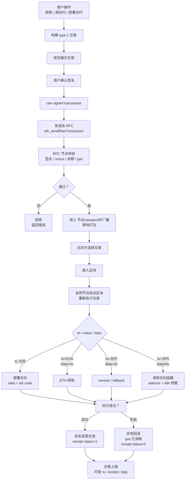

お読みになる前に、本稿はあくまで筆者個人の見解であることをご了承ください。

========

ウォレットは、ユーザーが現実世界とweb3の世界を行き来する際に用いるアカウントであり、web3を探索するための入口ともいえる存在です（私個人の理解では）。そこで今回は、この認識をもとにウォレットを主体として、1つのウォレットがオンチェーンで行える基本的な操作を重点的に調べました。プロジェクトのデモページはこちらです：[https://evm-wallet.block.dreaifehebi.com/](https://evm-wallet.block.dreaifehebi.com/)

::github{repo="dreaifeHebi/evm-eoa-wallet-demo"}

# ウォレットの作成と操作範囲

## ウォレットの作成とインポート

- ウォレットの作成

	一般に、\[1,n)の範囲に収まる乱数を生成すれば、有効なウォレット秘密鍵として使用できます。その秘密鍵dからd\*Gで得られる公開鍵をkeccak256で計算して導出したウォレットアドレスが、この秘密鍵に対応するブロックチェーン上のウォレットです。言い換えれば、理論上ウォレットは常にブロックチェーン上に存在しており、そのアドレスに対応する秘密鍵を作成すれば、まだ誰にも使われていない限り、そのownerとしてウォレットを有効化し、使用できるようになります。

	しかし、ウォレットを生成するたびに専用の乱数を作成する必要があるのは少々面倒です。また、ランダムな16桁の大きな数を覚えることも簡単ではありません。それでは、一定の規則に従う複数のウォレットを一括で作成し、復元時には覚えやすい1つの共通情報だけですべてを復元する方法はないのでしょうか。そこで登場するのがHDウォレット（Hierarchical Deterministic Wallet）、つまり現在最も一般的に使用されているニーモニックウォレットです。

	HDウォレットでは、BIP-39によってニーモニックとseedを生成し、BIP-32によってseedからmを導出します。最後にBIP-44のm/44‘/60’/acc‘/0/iという形式に従って、複数のウォレットを一括で計算・生成します。

- ウォレットの復元／インポート

	通常のウォレットであれば、0xから始まる秘密鍵の文字列を覚えておくだけで復元できます（驚異的な記憶力があればの話ですが）。

	より一般的なHD walletの場合は、前述の導出フローをたどって、よく使われるアドレスを復元します。具体的な手順は、BIP-39によるニーモニックの生成からそのまま連続しています。

## 検証とトランザクション

ウォレットが開始する操作を、オンチェーン状態を直接変更できるかどうかで分類すると、おおむね検証とトランザクションの2種類に分けられます。

- 検証

	検証とは、その名のとおり、以前のブログでも説明したように、EIP-191形式のフィールド（一般にはSIWE形式）に署名し、署名を受け取ったサービス側にウォレットの所有権を検証してもらうことです。

	::site{url="https://dreaife.tokyo/evm-wallet-login/"}

	もちろん、ウォレットが署名のような単純な操作しかできないのであれば、実現できることはあまりにも限られてしまいます。そこで登場したのがEIP-712です。

	共通認識できる署名フィールドを定義することで、ユーザーは署名するだけで、DAppやその他のサービスにトランザクションの開始を許可できます。それによってオンチェーンのスマートコントラクトから署名内容を実行でき、ユーザーはオンチェーン資産をより簡単かつ便利に管理できます。

	このほか、EOAウォレットにコントラクトウォレットに近い機能を持たせるEIP-7702のようなプロトコルもありますが、ここでは主にEOAウォレットを対象としているため、詳しくは調べていません。

- トランザクション

	トランザクションは、ウォレットがオンチェーン状態を能動的に変更するための基本的な方法です。通常はto｜value｜data｜nonce｜gas｜chainIdといった基本要素が含まれます。これらのフィールドを制御することで、ウォレットが開始するトランザクションでは、送金、コントラクトの呼び出し、コントラクトのデプロイなどの基本操作を実行できます。

# HDウォレットの作成

ここからは、現在最も一般的なHDウォレットについて、ETHチェーン上のウォレットがどのようにニーモニックを生成し、そこから$2^{31}*2^{31}$通り（accountのhardened導出による$2^{31}$通り\*address_indexのnon-hardened導出による$2^{31}$通り）のウォレット秘密鍵を導出できるのかを紹介します。

## HDウォレットの秘密鍵作成フロー

ニーモニックの生成から、実際にウォレットアドレスを制御できる秘密鍵を導出するまでの一連の処理は、一般に次のフローに従います。

- BIP-39でニーモニックとseedを生成
- BIP-32でseedからマスターキーmを導出
- BIP-44では、Ethereum向けのm/44’/60’/account’/0/iという導出規則に従い、accountとiから秘密鍵を決定論的に導出

以下では各工程を詳しく説明します。

## ニーモニックとseedの生成

ニーモニックの生成

- ランダムエントロピーentropyを生成

	BIP-39でニーモニックを生成する場合、最初に128/160/192/224/256 bitの乱数を生成します。

	これらは、それぞれ12語／15語／18語／21語／24語のニーモニックに対応します。ここでは256bitのentropy、つまり24語のニーモニックを生成する場合を例にします。

- entropyをSHA-256で計算し、新しい256bitの数値を取得
- 長さENT/32のchecksumを取得

	言い換えると、まずSHA-256で計算したデータからchecksumを求め、その結果の先頭からENT/32の長さを取得します。256bitの乱数の場合は、checksumの先頭8bitを取得します。

- entropyとchecksumを連結し、256bit+8bit、つまり264bitの数値を取得
- このデータを11bit単位でグループ化すると、264/11 = 24グループになり、これが256bitから24語のニーモニックが生成される理由
- 各グループについて、2048（$2^{11}$）語からなるBIP-39 wordlistから対応するwordを選択
- ここで得られた24個のwordが、一般にHDウォレットで使用されるニーモニック

次に、ニーモニックからseedを生成します。

ここではPBKDF2-HMAC-SHA512を使用して、512bitのseedを計算します。具体的な計算は次のとおりです。

$PBKDF2-HMAC-SHA512(password=mnemonic ,salt="mnemonic"+password,iteration=2048,dkLen=64bytes)$

つまり、UTF-8バイトストリーム化したニーモニックをpasswordとし、saltを「mnemonic」+passwordとして、HMAC-SHA512をiteration=2048回実行します。最初のU1はニーモニック、password、block_indexから計算し（U1=HMAC(password,salt \|\| INT(block_index))）、U2以降は前回の計算結果$U_{i-1}$を用いてHMAC-SHA512を計算します（U2=HMAC(password, U1)）。

最終的に計算される最初のblockのresultは、U1 xor U2 xor … xor U2048となります。512bitの出力は必要な長さである64byteと一致するため、blockは1つだけです。このとき出力されるresultが、BIP-39の規則に従って生成されたseedになります。

## マスターキーmの導出

BIP-32に従い、前述のseedに対してもう一度HMAC-SHA512を実行し、Iを取得します。具体的な内容は次のとおりです。

$I = HMAC-SHA512(key = \text{``Bitcoin seed''}, data = seed)$

ここで512bitのIが得られます。これを256bitずつ、左右それぞれ256bitの数値に分割します。

左側の$I_L$をmaster private key、右側の$I_R$をmaster chain codeとして使用します。

これらは、次のBIP-44による導出計算で使用されます。

## 特定の秘密鍵の導出計算

続いて、BIP-44がマスターキーからm/44’/60’/account’/0/iというパスをたどり、BIP-32によって特定の秘密鍵を計算する方法を見ていきます。

ここからsecp256k1楕円曲線の群演算に入るため、基礎知識をご存じない方は、以前書いた原理の解説もぜひご覧ください（

::site{url="https://dreaife.tokyo/eoa-sign-verify/"}

- 導出パスm/44’/60’/account’/0/i

	まず、導出パスとは何かを説明します。

	導出パスは、マスターキーmをルートノードとする深さ6階層のツリーとして理解できます。各階層には$2^{32}$個の数値がありますが、通常はその半分、つまり$2^{31}$個だけを使用します。各階層の数値の右上に付く‘によってhardenedかどうかが決まり、その階層の数値iをそのまま使用するか（\[0,$2^{31}$)）、i‘=i+$2^{31}$として使用するかが決まります。

	また、このhardenedマークは、子ノードを計算するときの計算方法にも影響します。

	mに続く44’/60’/account’/0/iの5階層には、それぞれ次の意味があります。

	- 44‘：BIP-44で規定されたpurpose
	- 60’：Ethereumで使用するcoin type
	- account‘：導出時に選択するアカウント番号
	- 0：external chain。通常の受取アドレスとして一般的に使用
	- i：各アカウントのi番目のアドレス
- non-hardened子ノードの計算方法

	ある階層の子ノードの数値iについて、親ノードの秘密鍵IL（以下pPk）とchainCode IR（以下pCc）から、次の式を使って子ノードのIを計算できます。

	$$
	
	$$

	ここで$serP(pPk*G)$は、0x02/0x03 \|\| (pPk\*G)_xを意味します。pPk\*Gは親ノードの公開鍵であり、0x02と0x03のどちらを使うかは、計算された親ノードの公開鍵（mod p）のyまたはp-yが奇数か偶数かによって決まります。

	得られたIは、同様に256bitずつ左右のILとIRに分割します。

	この子ノードのchild private keyは、(IL+parent private key) mod nです。

	子ノードのchild chain codeはIRです。

- hardened子ノードの計算方法

	ある階層の子ノードの数値i’について、親ノードの秘密鍵IL（以下pPk）とchainCode IR（以下pCc）から、次の式を使って子ノードのIを計算できます。

	$$
	
	$$

	ここで0x00は秘密鍵pPkを直接使用することを意味するため、公開鍵のyが奇数か偶数かを判定する必要はありません。

	得られたIは、同様に256bitずつ左右のILとIRに分割します。

	この子ノードのchild private keyは`(IL+parent private key) mod n`です。

	子ノードのchild chain codeは`IR`です。

- 最終的に得られる秘密鍵

	m/44’/60’/account’/0/iに従って階層ごとに導出し、最終的にaddress_index iのリーフノードへ到達します。この選択したノードで計算されたchild private keyが、そのアカウントアドレスの秘密鍵dです。実際のアカウントアドレスは、通常どおり秘密鍵d\*Gをkeccak256で計算し、末尾20byteを取得することで導出できます。

	また、このアドレスには、EIP-55のchecksumによって通常のアドレスを大文字と小文字が混在するアドレスへ変換して検証し、アドレス形式の正当性を保証する仕組みがあります（文字列形式や入力ミスの確認）。

	> EIP-55は、アドレスの文字自体を変更せず、そのアドレスのkeccak256計算結果に基づいて大文字と小文字だけを変更する方式です。i番目の文字がa-fであり、keccak256計算結果の対応するi番目の値が8以上であれば大文字にし、それ以外は変更しません。

# ウォレットのトランザクション

トランザクションは、オンチェーンで処理できるようにするための外枠と手数料モデル、トランザクションの動作を実際に決定するto / value / dataといった主要パラメータ、そしてnonce/chainIdなどの検証パラメータに分けられます。

## トランザクションの構造

通常のEIP-1559/type2トランザクションの内部構造は、おおむね次のようになります。

```javascript
type: 0x02

chainId
nonce

maxPriorityFeePerGas
maxFeePerGas
gasLimit

to
value
data

accessList

signatureYParity
signatureR
signatureS
```

これは属性を列挙しただけのものです。未署名トランザクションは、一般によりJSONに近い形式になります。

```javascript
{
  chainId: 1,
  nonce: 42,
  to: "0xContractOrEOA...",
  value: "1000000000000000000",
  data: "0x...",
  gasLimit: "21000",
  maxFeePerGas: "...",
  maxPriorityFeePerGas: "..."
}
```

署名後は、検証用の署名と同様にr/s/vが生成され、それらが上記JSONの末尾に追加されます。

続いて、以下の構造に従って、トランザクション内容と署名から構成されるトランザクションをbytes列へエンコードし、raw signed transactionとします。エンコード済みのトランザクションはRPCへ送信してブロードキャストし、オンチェーンへの取り込みを待つことができます。

```javascript
0x02 || rlp([
  chainId,
  nonce,
  maxPriorityFeePerGas,
  maxFeePerGas,
  gasLimit,
  to,
  value,
  data,
  accessList,
  yParity,
  r,
  s
])
```

各フィールドの役割は次のとおりです。

- chainId：同じトランザクションが別のチェーンで再実行されることを防止
- nonce：アカウントのトランザクション番号。同じトランザクションの重複実行を防ぎ、トランザクションの順序も決定する（ここでのnonceは、現在のチェーン上で操作するウォレットのnonceであり、前回のトランザクションのnonceから+1の順序にする必要がある）
- to：送信先アドレス。空の場合はコントラクトをデプロイ
- value：同時に送信するネイティブ通貨の数量
- data/input：コントラクト呼び出しのcalldata、またはコントラクトをデプロイするときのinit code
- gasLimit：このトランザクションで消費できるgasの最大量
- maxFeePerGas：ユーザーが支払う意思のある単価の上限
- maxPriorityFeePerGas：validator/proposerへ支払うチップの上限
- signature：EOAウォレットによるトランザクション内容への署名

## 手数料モデル

一般的な手数料モデルは次のとおりです。

<table>
<colgroup>
<col width="158.6640625">
<col width="182.6640625">
<col width="328.6640625">
</colgroup>
<tr>
<td>タイプ</td>
<td>名称</td>
<td>要点</td>
</tr>
<tr>
<td>legacy / 一般にtype 0</td>
<td>旧形式のトランザクション</td>
<td>gasPrice + gasLimit。typed envelopeなし</td>
</tr>
<tr>
<td>type 1</td>
<td>EIP-2930 access list</td>
<td>legacyの手数料モデルであるgasPriceに加え、accessListを含む</td>
</tr>
<tr>
<td>type 2</td>
<td>EIP-1559</td>
<td>maxFeePerGas + maxPriorityFeePerGas + gasLimit</td>
</tr>
<tr>
<td>type 3</td>
<td>EIP-4844 blob tx</td>
<td>rollupへblobデータを送信し、追加でmaxFeePerBlobGas、blobVersionedHashesを含む</td>
</tr>
<tr>
<td>type 4</td>
<td>EIP-7702 set-code tx</td>
<td>EOAがauthorizationListによってdelegation codeを設定し、コントラクトアカウントに近い機能を持てるようにする</td>
</tr>
</table>

ここでは現在一般的に使用される基本的なトランザクションだけを対象としているため、上記の構造はtype2を基準に記述しています。

## トランザクションのライフサイクル

一般にトランザクションは、アプリケーションの呼び出し時、またはウォレット内で内容を構築して署名し、完成したトランザクションをRPCへ送信してブロードキャストし、オンチェーンへ取り込ませます。おおまかなフローは次のとおりです。


```mermaid
flowchart TD
    A["用户操作<br/>转账 / 调合约 / 部署合约"] --> B["构建 type 2 交易"]

    B --> C["钱包展示交易"]
    C --> D["用户确认签名"]
    D --> F["raw signed transaction"]
    F --> G["发送给 RPC<br/>eth_sendRawTransaction"]

    G --> H["RPC 节点校验<br/>签名 / nonce / 余额 / gas"]
    H --> I{"通过？"}
    I -->|"否"| X["拒绝<br/>返回错误"]
    I -->|"是"| J["进入 节点mempool并广播<br/>等待打包"]

    J --> K["出块方选择交易"]
    K --> L["放入区块"]
    L --> M["全网节点验证区块<br/>重新执行交易"]

    M --> N{"to / value / data"}

    N -->|"to 为空"| O["部署合约<br/>data = init code"]
    N -->|"to=EOA<br/>data=0x"| P["ETH 转账"]
    N -->|"to=合约<br/>data=0x"| Q["receive / fallback"]
    N -->|"to=合约<br/>data≠0x"| R["调用合约函数<br/>selector + ABI 参数"]

    O --> S["执行成功？"]
    P --> S
    Q --> S
    R --> S

    S -->|"成功"| T["状态变更生效<br/>receipt status=1"]
    S -->|"失败"| U["状态回滚<br/>gas 已消耗<br/>receipt status=0"]

    T --> V["交易上链<br/>可查 tx / receipt / logs"]
    U --> V
```

# ウォレットによる検証

冒頭で述べたように、ウォレットでは直接オンチェーンで実行されるトランザクションだけでなく、直接オンチェーンには記録されない検証操作も行えます。

## SIWE標準による通常のウォレット所有権の検証

ここでは、ウォレットがサービス側に対して、ユーザーがそのウォレットを制御していることを証明します。具体的な内容については、前述のブログを参照してください（

::site{url="https://dreaife.tokyo/evm-wallet-login/"}

## EIP-712：コントラクトに権限を付与できる検証方式

EIP-712は、EIP-712形式の署名内容への同意を表す認可検証です。ただし、これはトランザクション内の署名に近く、コントラクト呼び出しに必要なパラメータへ署名することで、その認可に対応したコントラクトがユーザー名義の資産を操作できるようにします。もちろん、これはあくまで署名にすぎません。署名内容によってオンチェーン状態を変更するには、サービス側が署名と呼び出し内容をトランザクションへまとめ、署名対象のコントラクトを呼び出す必要があります。

- 署名内容

	署名内容は一般に次のような形式です。

	```javascript
	{
	  types: {
	    EIP712Domain: [
	      { name: "name", type: "string" },
	      { name: "version", type: "string" },
	      { name: "chainId", type: "uint256" },
	      { name: "verifyingContract", type: "address" }
	    ],
	    Permit: [
	      { name: "owner", type: "address" },
	      { name: "spender", type: "address" },
	      { name: "value", type: "uint256" },
	      { name: "nonce", type: "uint256" },
	      { name: "deadline", type: "uint256" }
	    ]
	  },
	  primaryType: "Permit",
	  domain: {
	    name: "DemoToken",
	    version: "1",
	    chainId: 1,
	    verifyingContract: "0xTokenContract..."
	  },
	  message: {
	    owner: "0xUser...",
	    spender: "0xDappOrRouter...",
	    value: "1000000000000000000",
	    nonce: 0,
	    deadline: 1710000000
	  }
	}
	```

	ここでtypesはデータ構造を定義します。primaryTypeは署名の主要構造で、Permit、Order、Forward、Requestなどがあります。domainは署名の適用範囲を指定し、messageはユーザーが実際に認可する内容です。

- EIP-712の署名が使用されるまでのフロー

	たとえばpermitタイプのEIP-712では、ownerであるユーザーが、spenderのアドレスにvalue数量のtokenを使用する権限を与える署名を行います。有効期限はdeadlineまで、nonceはnです。その後、この認可を署名としてDAppへ返し、DAppは認可とその内容を使ってpermit( owner, spender, value, deadline, v, r, s)トランザクションを開始します。コントラクトは署名が署名内容と一致することを検証したうえで、認可内容に従って状態を変更します。

	具体的な手順は次のとおりです。

	1. プロトコル／コントラクトが署名可能な構造を事前に定義<br>Permit(owner, spender, value, nonce, deadline)
	2. DAppがEIP-712 typed dataを構築<br>types、domain、primaryType、messageを含む
	3. ウォレットが署名内容を表示<br>ユーザーは、対象となるDApp、チェーン、コントラクト、認可内容を確認
	4. ユーザーの確認後、EOAの秘密鍵で署名<br>ウォレットがdigestを計算：<br>keccak256("\\x19\\x01" \|\| domainSeparator \|\| hashStruct(message))<br>その後、r/s/vを署名として生成
	5. ウォレットがsignatureをDApp／サービス側へ返却<br>この時点ではまだオンチェーンではなく、gasも状態変化も発生しない
	6. DApp／relayer／その他の主体がトランザクションを構築<br>message内のフィールドとsignatureをまとめてコントラクトへ渡す
	7. コントラクトがオンチェーンで同じdigestを再構築<br>その後、ecrecover / ECDSA.recoverによってsignerを復元
	8. コントラクトが署名の正当性を確認<br>signerがownerと一致するか<br>nonceが未使用か<br>deadlineを過ぎていないか<br>chainId / verifyingContract / domainが一致するか
	9. 検証に成功した場合、コントラクトが状態を変更<br>たとえばallowanceの設定、注文の約定、meta transactionの実行
	10. nonceを消費<br>同じ署名が再利用されることを防止

# コード上の実装

今回の実装では、主にethers.jsをインポートして使用しています（正直なところ、このライブラリは本当に書き心地がよく、さまざまなビット演算をしていると競技プログラミングをしていた頃に戻ったような気分になりますlol）。

## EOA/HDウォレット

ウォレットの作成について、現在の実装では、市販のウォレットやethersライブラリのデフォルトと同様に、デフォルトで0番目のaccountにある0番目のアドレスの秘密鍵を使用しています。具体的な実装は次のとおりです。使用するパスはm/44‘/60’/0‘/0/0で、主にethersのWalletを使い、createRandomによる作成、newによる直接インポート、HDNodeWallet.fromPhraseによるインポートを行っています。

```javascript
const DEFAULT_DERIVATION_PATH = "m/44'/60'/0'/0/0";

function createWallet() {
  const nextWallet = ethers.Wallet.createRandom();
  selectWallet(nextWallet, "Created wallet");
}

function importWallet() {
  const nextWallet = new ethers.Wallet(importKey.trim());
  selectWallet(nextWallet, "Imported wallet");
}

function importSeedPhrase() {
  const phrase = seedPhrase.trim().replace(/\s+/g, " ");
  const nextWallet = ethers.HDNodeWallet.fromPhrase(
    phrase,
    "",
    DEFAULT_DERIVATION_PATH
  );
  selectWallet(nextWallet, `Imported seed phrase at ${DEFAULT_DERIVATION_PATH}`);
}
```

## EIP-191による通常の署名

```javascript
function personalSignEnvelope(message: string) {
  const byteLength = ethers.toUtf8Bytes(message).length;
  return `0x19 || "Ethereum Signed Message:\n${byteLength}" || utf8(message)`;
}

async function signMessage() {
  const activeWallet = requireWallet();
  const nextSignature = await activeWallet.signMessage(message);
  setSignature(nextSignature);
}

function verifyMessage() {
  const recovered = ethers.verifyMessage(message, signature);
  const digest = ethers.hashMessage(message);
  setRecoveredAddress(recovered);
}
```

## EIP-712署名

- 署名内容の構築と検証

	```javascript
	const typedDomain = {
	  name: "EOA Wallet Lab",
	  version: "1",
	  chainId: BigInt(typedChainId || "1"),
	  verifyingContract: typedVerifier || ZERO_ADDRESS
	};

	const typedTypes = {
	  LoginRequest: [
	    { name: "owner", type: "address" },
	    { name: "statement", type: "string" },
	    { name: "nonce", type: "string" },
	    { name: "deadline", type: "uint256" }
	  ]
	};

	const typedValue = {
	  owner: wallet?.address || ZERO_ADDRESS,
	  statement: typedStatement,
	  nonce: typedNonce,
	  deadline: BigInt(typedDeadline || "0")
	};

	async function signTypedData() {
	  const activeWallet = requireWallet();
	  const nextSignature = await activeWallet.signTypedData(
	    typedDomain,
	    typedTypes,
	    typedValue
	  );
	  setTypedSignature(nextSignature);
	}

	function verifyTypedData() {
	  const recovered = ethers.verifyTypedData(
	    typedDomain,
	    typedTypes,
	    typedValue,
	    typedSignature
	  );
	  const digest = ethers.TypedDataEncoder.hash(typedDomain, typedTypes, typedValue);
	  setTypedRecovered(recovered);
	}
	```

- type2トランザクションの構築と署名

	```javascript
	function buildTxRequest(): ethers.TransactionRequest {
	  return {
	    type: 2,
	    to,
	    value: ethers.parseEther(txValue || "0"),
	    data,
	    chainId: BigInt(txChainId || "1"),
	    nonce: Number(txNonce || "0"),
	    gasLimit: BigInt(txGasLimit || "21000"),
	    maxFeePerGas: ethers.parseUnits(txMaxFee || "1", "gwei"),
	    maxPriorityFeePerGas: ethers.parseUnits(txPriorityFee || "1", "gwei")
	  };
	}

	async function signTransaction() {
	  const activeWallet = requireWallet();
	  const signed = await activeWallet.signTransaction(buildTxRequest());
	  const parsed = ethers.Transaction.from(signed);

	  setRawTx(signed);
	  setTxHash(parsed.hash || "");
	}

	function verifyRawTransaction() {
	  const parsed = ethers.Transaction.from(rawTx);
	  setTxHash(parsed.hash || "");
	  setTxSigner(parsed.from || "");
	}
	```

- トランザクションのブロードキャスト

	```javascript
	async function broadcastTransaction() {
	  const signed = rawTx || (await requireWallet().signTransaction(buildTxRequest()));
	  const provider = new ethers.JsonRpcProvider(rpcUrl);
	  const parsed = ethers.Transaction.from(signed);

	  const response = await provider.broadcastTransaction(signed);

	  setRawTx(signed);
	  setTxHash(parsed.hash || response.hash);
	  setTxSigner(parsed.from || "");
	  setBroadcastHash(response.hash);

	  const receipt = await provider.waitForTransaction(response.hash, 1, 60_000);
	}
	```

# まとめ

今回のブログでは、ウォレットの視点から、現在一般的に使われているHDウォレットと、オンチェーンおよびオフチェーンでよく使われる署名検証やトランザクションについて、一通り整理しました。

正直なところ、当初は15日か16日頃にはおおよその構成を把握して書き始めるつもりでした。しかし、途中で急に絵を描きたいという強い衝動に駆られ、4日以上かけて自分にとって初めての絵を描き、ついでに少し休みましたXD。それでも、その間に精神面でもう一度鍛えられ、現実をよりはっきり見られるようになって少し成長できたと思います（
