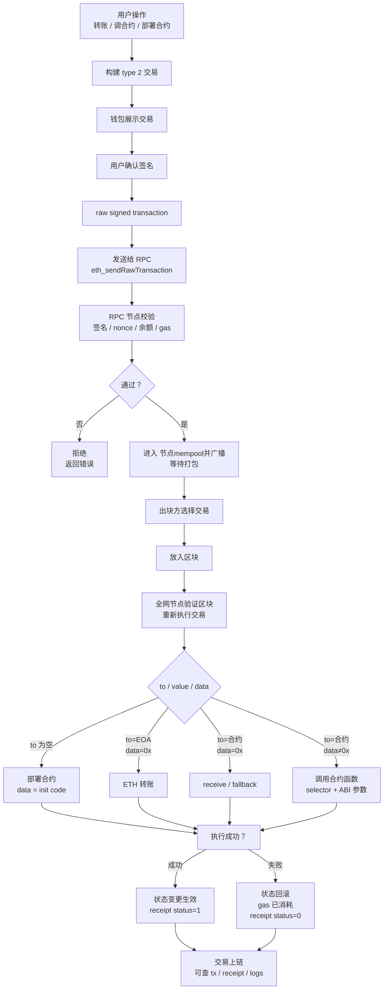

読む前の注意：本稿は、あくまで筆者個人の見解を示すものです。

========

ウォレットは、ユーザーが現実世界とWeb3の世界でやり取りする際に用いるアカウントであり、Web3を探索するための入り口ともいえる存在です（個人的な理解では）。そこで今回は、この認識をもとにウォレットを主体として、1つのウォレットがオンチェーンで実行できる基本的な操作を重点的に調べました。プロジェクトのデモページはこちらです：[https://evm-wallet.block.dreaifehebi.com/](https://evm-wallet.block.dreaifehebi.com/)

::github{repo="dreaifeHebi/evm-eoa-wallet-demo"}

# ウォレットの作成と操作範囲

## ウォレットの作成とインポート

- ウォレットの作成

	一般に、\[1,n)を満たす乱数を1つ生成すれば、有効なウォレットの秘密鍵とみなせます。この秘密鍵からd\*Gで得られる公開鍵をkeccak256にかけて算出したウォレットアドレスが、その秘密鍵に対応してblock chain上に存在するウォレットです。言い換えれば、理論上ウォレットはblock chain上に常に存在しており、そのアドレスに対応する秘密鍵を作成できれば、ほかの誰にも使われていない限り、そのownerとしてウォレットを有効化して使用できます。

	しかし、ウォレットを生成するたびに乱数をわざわざ作成するのは少々面倒ですし、ランダムな16桁の大きな数を覚えるのも簡単ではありません。それでは、一定のパターンに従う複数のウォレットをより簡単に一括作成し、復元時には覚えやすい1つの共通情報だけですべてをまとめて復元する方法はないのでしょうか。そこで登場するのがHDウォレット（Hierarchical Deterministic Wallet）、つまり現在最も一般的に使われているニーモニックフレーズウォレットです。

	BIP-39によってニーモニックフレーズとそのseedを生成し、BIP-32によってseedからmを導出した後、BIP-44に従ってm/44‘/60’/acc‘/0/iという形式で複数のウォレットを計算・生成します。

- ウォレットの復元／インポート

	通常のウォレットであれば、0xから始まる秘密鍵の文字列を覚えておくだけで復元できます（驚異的な記憶力があれば）。

	より一般的なHD walletの場合は、前述の導出フローをたどって、よく使用するアドレスを復元します。具体的な手順は、BIP-39によるニーモニックフレーズの生成からそのまま続けられます。

## 検証とトランザクション

ウォレットが開始する操作を、オンチェーンの状態を直接変更できるかどうかで分類すると、おおむね検証とトランザクションの2種類に分けられます。

- 検証

	検証とは、その名のとおり、以前のblogで説明したように、EIP-191形式のフィールド（通常はSIWE形式）に署名し、その署名を受け取ったサービス側がウォレットの所有権を検証することです。

	::site{url="https://dreaife.tokyo/evm-wallet-login/"}

	もちろん、ウォレットが署名のような単純な操作しかできないのであれば、実行できることがあまりにも限られてしまいます。そこでEIP-712が登場しました。

	共通仕様に基づく署名フィールドを定義することで、ユーザーは署名するだけでDAppやその他のサービスに権限を与え、トランザクションを送信してオンチェーンのスマートコントラクトに署名内容を実行させられます。これにより、ユーザーはオンチェーン資産をより手軽に管理できます。

	また、EOAウォレットにコントラクトウォレットに近い機能を持たせるEIP-7702のようなプロトコルもありますが、ここでは主にEOAウォレットについて扱うため、詳しくは調べていません。

- トランザクション

	トランザクションは、ウォレットがオンチェーンの状態を能動的に変更するための基本的な方法です。通常はto｜value｜data｜nonce｜gas｜chainIdといった基本要素を含みます。これらのフィールドを制御することで、ウォレットが開始するトランザクションは、送金、コントラクトの呼び出し、コントラクトのデプロイなどの基本操作を実行できます。

# HDウォレットの作成

ここからは、現在最も一般的に使用されているHDウォレットについて、ETHチェーン上のウォレットでニーモニックフレーズを生成し、そこから$2^{31}*2^{31}$（accountのhardened導出による$2^{31}$通り\*address_indexのnon-hardened導出による$2^{31}$通り）のウォレット秘密鍵を導出する仕組みを説明します。

## HDウォレットの秘密鍵作成フロー

ニーモニックフレーズの生成から、ウォレットアドレスを実際に制御できる秘密鍵を導出するまでには、通常、次のような流れに従います。

- BIP-39でニーモニックフレーズとseedを生成する
- BIP-32でseedからマスターキーmを導出する
- BIP-44では、Ethereum用のm/44’/60’/account’/0/iという導出規則に従い、accountとiから決定論的に秘密鍵を導出する

以下では、各ステップを詳しく説明します。

## ニーモニックフレーズとseedの生成

ニーモニックフレーズの生成

- ランダムエントロピーentropyを生成する

	BIP-39でニーモニックフレーズを生成する際は、最初に128/160/192/224/256 bitの乱数を生成します。

	それぞれ12語／15語／18語／21語／24語のニーモニックフレーズに対応します。ここでは256bitのentropy、すなわち24語のニーモニックフレーズを生成する場合を例にします。

- entropyにSHA-256を適用し、新しい256bitの値を取得する
- 長さがENT/32のchecksumを取得する

	つまり、SHA-256の計算結果からchecksumを求め、その先頭からENT/32の長さだけを取得します。256bitの乱数の場合は、checksumの先頭8bitを取得します。

- entropyとchecksumを連結し、256bit+8bit、すなわち264bitの値を得る
- このデータを11bitずつに分割すると264/11 = 24グループとなる。これが256bitから24語のニーモニックフレーズが生成される理由である
- 各グループについて、2048（$2^{11}$）語からなるBIP-39 wordlistから対応するwordを選択する
- こうして得られた24個のwordが、一般的なHDウォレットで使用されるニーモニックフレーズとなる

続いて、ニーモニックフレーズからseedを生成します。

ここではPBKDF2-HMAC-SHA512を使って512bitのseedを算出します。具体的な計算は次のとおりです。

$PBKDF2-HMAC-SHA512(password=mnemonic ,salt="mnemonic"+password,iteration=2048,dkLen=64bytes)$

つまり、ニーモニックフレーズをutf8 byte streamに変換したものをpasswordとし、saltを「mnemonic」+passwordとして、HMAC-SHA512をiteration=2048回実行します。最初のU1はニーモニックフレーズ、password、block_indexから計算されます（U1=HMAC(password,salt \|\| INT(block_index)))。U2以降は、前回計算した$U_{i-1}$を使ってHMAC-SHA512を計算します（U2=HMAC(password, U1)）。

最終的に計算される最初のblockのresultは、U1 xor U2 xor … xor U2048です。512bitの出力が必要な64byteの長さと一致するため、blockは1つだけです。このとき出力されるresultが、BIP-39の規則に従って生成されたseedとなります。

## マスターキーmの導出

BIP-32に従い、上で算出したseedに対して、さらにHMAC-SHA512を1回実行してIを得ます。具体的には次のとおりです。

$I = HMAC-SHA512(key = \text{``Bitcoin seed''}, data = seed)$

ここで得られるIは512bitです。256bitずつに分けることで、左右それぞれ256bitの値に分割できます。

左側の$I_L$をマスター秘密鍵master private key、右側の$I_R$をmaster chain codeとして使用します。

これらは、次のBIP-44の導出計算で使用されます。

## 特定の秘密鍵の導出計算

続いて、BIP-44がマスターキーからm/44’/60’/account’/0/iというパスに沿って、BIP-32により特定の秘密鍵を算出する方法を説明します。

ここからsecp256k1楕円曲線の群演算に入るため、基礎知識がない場合は、以前書いた原理の解説もご覧ください（

::site{url="https://dreaife.tokyo/eoa-sign-verify/"}

- 導出パスm/44’/60’/account’/0/i

	まず、導出パスとは何かを説明します。

	導出パスは、マスターキーmをルートノードとする深さ6層の木として理解できます。各階層には$2^{32}$通りの値がありますが、通常はその半分、つまり$2^{31}$通りだけを使用します。これは、各階層の数字の右上に付く‘がhardenedを表すかどうかによって、その階層の数字iをそのままi（\[0,$2^{31}$)）として使用するか、i‘=i+$2^{31}$として使用するかが決まるためです。

	また、このhardenedの印は、子ノードを計算する方法にも影響します。

	mに続く44’/60’/account’/0/iという5階層には、それぞれ次の意味があります。

	- 44‘：BIP-44で規定されたpurpose
	- 60’：Ethereumで使用されるcoin type
	- account‘：導出時に選択するアカウント番号
	- 0：external chain。通常の受取アドレスに使用される
	- i：各アカウントにおけるi番目のアドレス
- non-hardened子ノードの計算方法

	ある階層の子ノード番号iについて、親ノードの秘密鍵IL（以下pPk）とchainCode IR（以下pCc）から、次の式によって子ノードのIを算出できます。

	$$
	
	$$

	ここで、$serP(pPk*G)$は0x02/0x03 \|\| (pPk\*G)_xを意味します。pPk\*Gは親ノードの公開鍵であり、0x02と0x03のどちらを使うかは、計算された親ノード公開鍵（mod p）のy/p-yが奇数か偶数かによって決まります。

	得られたIも同様に、256bitずつ左右のILとIRに分割します。

	この子ノードの秘密鍵child private keyは、(IL+parent private key) mod nです。

	子ノードのchild chain codeにはIRを使用します。

- hardened子ノードの計算方法

	ある階層の子ノード番号i’について、親ノードの秘密鍵IL（以下pPk）とchainCode IR（以下pCc）から、次の式によって子ノードのIを算出できます。

	$$
	
	$$

	ここで0x00は秘密鍵pPkを直接使用することを意味するため、公開鍵のyが奇数か偶数かを判定する必要はありません。

	得られたIも同様に、256bitずつ左右のILとIRに分割します。

	この子ノードの秘密鍵child private keyは`(IL+parent private key) mod n`です。

	子ノードのchild chain codeには`IR`を使用します。

- 最終的に得られる秘密鍵

	m/44’/60’/account’/0/iに従って階層ごとに導出し、最終的にaddress_index iのリーフノードへ到達します。この選択されたノードで算出されたchild private keyが、そのアカウントアドレスの秘密鍵dとなります。実際のアカウントアドレスは、通常どおり秘密鍵d\*Gにkeccak256を適用し、末尾20byteを取得することで求められます。

	また、このアドレスにはEIP-55のchecksumを用いて、通常のアドレスを大文字と小文字が混在するアドレスへ変換して検証する方法があります。これにより、アドレス形式の妥当性を確認できます（文字列形式／入力ミスの確認）。

	> EIP-55はアドレスの文字自体を変更せず、そのアドレスのkeccak256計算結果に基づいて大文字と小文字だけを変更する方式です。i番目の文字がa-fであり、keccak256計算結果の対応するi番目の値が8以上であれば大文字にし、それ以外は変更しません。

# ウォレットのトランザクション

トランザクションは、オンチェーンに載せるためのトランザクションエンベロープと手数料モデル、トランザクションの操作を実際に機能させるto / value / dataといった重要なパラメータ、そしてnonce/chainIdなどの検証用パラメータに分けられます。

## トランザクションの構造

一般的なEIP-1559/type2トランザクションの内部構造は、おおむね次のようになります。

```javascript
type: 0x02

chainId
nonce

maxPriorityFeePerGas
maxFeePerGas
gasLimit

to
value
data

accessList

signatureYParity
signatureR
signatureS
```

ここでは属性を列挙しているだけですが、未署名のトランザクションは通常、よりjsonに近い形式になります。

```javascript
{
  chainId: 1,
  nonce: 42,
  to: "0xContractOrEOA...",
  value: "1000000000000000000",
  data: "0x...",
  gasLimit: "21000",
  maxFeePerGas: "...",
  maxPriorityFeePerGas: "..."
}
```

署名後は、検証用の署名と同様にr/s/vが生成され、それらが上記jsonの末尾に追加されます。

その後、以下の構造に従い、トランザクションの内容と署名を1つのbytes列にエンコードしてraw signed transactionとします。エンコード済みのトランザクションはRPCへ送信してブロードキャストし、オンチェーンへの取り込みを待ちます。

```javascript
0x02 || rlp([
  chainId,
  nonce,
  maxPriorityFeePerGas,
  maxFeePerGas,
  gasLimit,
  to,
  value,
  data,
  accessList,
  yParity,
  r,
  s
])
```

各フィールドの役割は次のとおりです。

- chainId：同じトランザクションが別のチェーンでリプレイされることを防ぐ
- nonce：アカウントのトランザクション番号。同じトランザクションの重複実行を防ぎ、実行順序も決定する（ここでのnonceは、現在のチェーン上で操作するウォレットのnonceであり、前回のトランザクションのnonceから+1の順序でなければならない）
- to：送信先アドレス。空の場合はコントラクトをデプロイする
- value：同時に送信するネイティブ通貨の数量
- data/input：コントラクト呼び出し用のcalldata、またはコントラクトをデプロイする際のinit code
- gasLimit：このトランザクションで消費できるgasの上限
- maxFeePerGas：ユーザーが支払う意思のある最大単価
- maxPriorityFeePerGas：validator/proposerに支払うチップの上限
- signature：EOAウォレットによるトランザクション内容への署名

## 手数料モデル

手数料モデルは、一般に次のように分類されます。

<table>
<colgroup>
<col width="158.6640625">
<col width="182.6640625">
<col width="328.6640625">
</colgroup>
<tr>
<td>タイプ</td>
<td>名称</td>
<td>要点</td>
</tr>
<tr>
<td>legacy / 一般にいうtype 0</td>
<td>旧形式トランザクション</td>
<td>gasPrice + gasLimit。typed envelopeはない</td>
</tr>
<tr>
<td>type 1</td>
<td>EIP-2930 access list</td>
<td>legacy手数料モデルのgasPriceに加え、accessListを持つ</td>
</tr>
<tr>
<td>type 2</td>
<td>EIP-1559</td>
<td>maxFeePerGas + maxPriorityFeePerGas + gasLimit</td>
</tr>
<tr>
<td>type 3</td>
<td>EIP-4844 blob tx</td>
<td>rollupへblobデータを送信し、追加でmaxFeePerBlobGas、blobVersionedHashesを持つ</td>
</tr>
<tr>
<td>type 4</td>
<td>EIP-7702 set-code tx</td>
<td>EOAがauthorizationListを通じてdelegation codeを設定し、コントラクトアカウントに近い機能を持てるようにする</td>
</tr>
</table>

ここでは現在一般的に使われている基本的なトランザクションのみを主に扱うため、上記の構造はtype2を基準に記述しています。

## トランザクションのライフサイクル

一般的なトランザクションは、アプリケーションの呼び出し時、またはウォレット内で内容を構築して署名し、完成したトランザクションをRPCへ送信してブロードキャストし、オンチェーンへ載せます。おおまかな流れは次のとおりです。


```mermaid
flowchart TD
    A["用户操作<br/>转账 / 调合约 / 部署合约"] --> B["构建 type 2 交易"]

    B --> C["钱包展示交易"]
    C --> D["用户确认签名"]
    D --> F["raw signed transaction"]
    F --> G["发送给 RPC<br/>eth_sendRawTransaction"]

    G --> H["RPC 节点校验<br/>签名 / nonce / 余额 / gas"]
    H --> I{"通过？"}
    I -->|"否"| X["拒绝<br/>返回错误"]
    I -->|"是"| J["进入 节点mempool并广播<br/>等待打包"]

    J --> K["出块方选择交易"]
    K --> L["放入区块"]
    L --> M["全网节点验证区块<br/>重新执行交易"]

    M --> N{"to / value / data"}

    N -->|"to 为空"| O["部署合约<br/>data = init code"]
    N -->|"to=EOA<br/>data=0x"| P["ETH 转账"]
    N -->|"to=合约<br/>data=0x"| Q["receive / fallback"]
    N -->|"to=合约<br/>data≠0x"| R["调用合约函数<br/>selector + ABI 参数"]

    O --> S["执行成功？"]
    P --> S
    Q --> S
    R --> S

    S -->|"成功"| T["状态变更生效<br/>receipt status=1"]
    S -->|"失败"| U["状态回滚<br/>gas 已消耗<br/>receipt status=0"]

    T --> V["交易上链<br/>可查 tx / receipt / logs"]
    U --> V
```

# ウォレットの検証

序文で述べたとおり、ウォレットが実行できる操作には、直接オンチェーンに記録されるトランザクションだけでなく、オンチェーンに直接記録されない検証処理もあります。

## SIWE標準による一般的なウォレット所有権の検証

これは、ウォレットを利用するユーザーが、そのウォレットを制御できることをサービス側へ証明するものです。具体的な内容については、上で紹介したblogを参照してください（

::site{url="https://dreaife.tokyo/evm-wallet-login/"}

## EIP-712：コントラクトへ権限を付与できる検証方式

EIP-712は、712署名の内容に同意したことを示す権限付与の検証方式です。ただし、トランザクション内の署名に近い性質を持ち、コントラクトの呼び出しに必要なパラメータへ署名することで、そのコントラクト内にある自分の資産を操作する権限を付与します（コントラクトがこの権限付与方式に対応している場合）。もちろん、これは署名にすぎません。この署名内容によってオンチェーンの状態を変更するには、サービス側が署名と呼び出し内容をトランザクションとしてまとめ、署名対象のコントラクトを呼び出す必要があります。

- 署名内容

	署名内容は一般に次のような形式になります。

	```javascript
	{
	  types: {
	    EIP712Domain: [
	      { name: "name", type: "string" },
	      { name: "version", type: "string" },
	      { name: "chainId", type: "uint256" },
	      { name: "verifyingContract", type: "address" }
	    ],
	    Permit: [
	      { name: "owner", type: "address" },
	      { name: "spender", type: "address" },
	      { name: "value", type: "uint256" },
	      { name: "nonce", type: "uint256" },
	      { name: "deadline", type: "uint256" }
	    ]
	  },
	  primaryType: "Permit",
	  domain: {
	    name: "DemoToken",
	    version: "1",
	    chainId: 1,
	    verifyingContract: "0xTokenContract..."
	  },
	  message: {
	    owner: "0xUser...",
	    spender: "0xDappOrRouter...",
	    value: "1000000000000000000",
	    nonce: 0,
	    deadline: 1710000000
	  }
	}
	```

	このうち、typesはデータ構造を定義します。primaryTypeは署名の主要構造で、Permit、Order、Forward、Requestなどがあります。domainは署名の適用範囲を指定し、messageはユーザーが実際に権限を付与する内容です。

- EIP-712の署名から使用までの流れ

	たとえばpermit型の712では、ownerであるユーザーが、spenderアドレスにvalue分のtokenを使用する権限を与え、有効期限をdeadline、nonceをnとして署名します。その権限を署名としてDAppへ返し、DAppはその権限と内容を使ってpermit( owner, spender, value, deadline, v, r, s)トランザクションを開始します。呼び出されたコントラクトは署名が署名内容と一致することを検証し、権限付与の内容に従って状態を変更します。

	具体的な流れは次のとおりです。

	1. プロトコル／コントラクトが署名可能な構造を定義する<br>Permit(owner, spender, value, nonce, deadline)
	2. DAppがEIP-712 typed dataを構築する<br>types、domain、primaryType、messageを含む
	3. ウォレットが署名内容を表示する<br>ユーザーは、対象となるDApp、チェーン、コントラクト、権限付与の内容を確認する
	4. ユーザーが確認した後、EOAの秘密鍵で署名する<br>ウォレットがdigestを計算する：<br>keccak256("\\x19\\x01" \|\| domainSeparator \|\| hashStruct(message))<br>その後、r/s/vを署名として生成する
	5. ウォレットがsignatureをDApp／サービス側へ返す<br>この時点ではオンチェーンに記録されておらず、gasも消費せず、状態変化も発生しない
	6. DApp／relayer／その他の者がトランザクションを構築する<br>message内のフィールドとsignatureをまとめてコントラクトへ渡す
	7. コントラクトがオンチェーンで同じdigestを再構築する<br>その後、ecrecover / ECDSA.recoverを使用してsignerを復元する
	8. コントラクトが署名の正当性を確認する<br>signerがownerと一致するか<br>nonceが未使用か<br>deadlineを過ぎていないか<br>chainId / verifyingContract / domainが一致するか
	9. 検証に成功すると、コントラクトが状態を変更する<br>たとえばallowanceの設定、注文の約定、meta transactionの実行など
	10. nonceを消費する<br>同じ署名が繰り返し使用されることを防ぐ

# コード上の実装

今回のコード実装では、主にethers.jsをインポートして利用しています（正直なところ、このライブラリは本当に書きやすく、さまざまなビット演算をしていると競技プログラミングをしていた頃に戻ったような気分になりますlol）。

## EOA/HDウォレット

現在のウォレット作成実装では、市販のウォレットやethersライブラリのデフォルトと同じく、デフォルトで0番目のaccountにある0番目のアドレスの秘密鍵を使用しています。具体的な実装は以下のとおりです。パスにはm/44‘/60’/0‘/0/0を使用し、主にethersのWalletを使ってcreateRandomで作成し、new/HDNodeWallet.fromPhraseで直接インポートしています。

```javascript
const DEFAULT_DERIVATION_PATH = "m/44'/60'/0'/0/0";

function createWallet() {
  const nextWallet = ethers.Wallet.createRandom();
  selectWallet(nextWallet, "Created wallet");
}

function importWallet() {
  const nextWallet = new ethers.Wallet(importKey.trim());
  selectWallet(nextWallet, "Imported wallet");
}

function importSeedPhrase() {
  const phrase = seedPhrase.trim().replace(/\s+/g, " ");
  const nextWallet = ethers.HDNodeWallet.fromPhrase(
    phrase,
    "",
    DEFAULT_DERIVATION_PATH
  );
  selectWallet(nextWallet, `Imported seed phrase at ${DEFAULT_DERIVATION_PATH}`);
}
```

## EIP-191の通常署名

```javascript
function personalSignEnvelope(message: string) {
  const byteLength = ethers.toUtf8Bytes(message).length;
  return `0x19 || "Ethereum Signed Message:\n${byteLength}" || utf8(message)`;
}

async function signMessage() {
  const activeWallet = requireWallet();
  const nextSignature = await activeWallet.signMessage(message);
  setSignature(nextSignature);
}

function verifyMessage() {
  const recovered = ethers.verifyMessage(message, signature);
  const digest = ethers.hashMessage(message);
  setRecoveredAddress(recovered);
}
```

## EIP-712署名

- 署名内容の構築と検証

	```javascript
	const typedDomain = {
	  name: "EOA Wallet Lab",
	  version: "1",
	  chainId: BigInt(typedChainId || "1"),
	  verifyingContract: typedVerifier || ZERO_ADDRESS
	};

	const typedTypes = {
	  LoginRequest: [
	    { name: "owner", type: "address" },
	    { name: "statement", type: "string" },
	    { name: "nonce", type: "string" },
	    { name: "deadline", type: "uint256" }
	  ]
	};

	const typedValue = {
	  owner: wallet?.address || ZERO_ADDRESS,
	  statement: typedStatement,
	  nonce: typedNonce,
	  deadline: BigInt(typedDeadline || "0")
	};

	async function signTypedData() {
	  const activeWallet = requireWallet();
	  const nextSignature = await activeWallet.signTypedData(
	    typedDomain,
	    typedTypes,
	    typedValue
	  );
	  setTypedSignature(nextSignature);
	}

	function verifyTypedData() {
	  const recovered = ethers.verifyTypedData(
	    typedDomain,
	    typedTypes,
	    typedValue,
	    typedSignature
	  );
	  const digest = ethers.TypedDataEncoder.hash(typedDomain, typedTypes, typedValue);
	  setTypedRecovered(recovered);
	}
	```

- type2トランザクションの構築と署名

	```javascript
	function buildTxRequest(): ethers.TransactionRequest {
	  return {
	    type: 2,
	    to,
	    value: ethers.parseEther(txValue || "0"),
	    data,
	    chainId: BigInt(txChainId || "1"),
	    nonce: Number(txNonce || "0"),
	    gasLimit: BigInt(txGasLimit || "21000"),
	    maxFeePerGas: ethers.parseUnits(txMaxFee || "1", "gwei"),
	    maxPriorityFeePerGas: ethers.parseUnits(txPriorityFee || "1", "gwei")
	  };
	}

	async function signTransaction() {
	  const activeWallet = requireWallet();
	  const signed = await activeWallet.signTransaction(buildTxRequest());
	  const parsed = ethers.Transaction.from(signed);

	  setRawTx(signed);
	  setTxHash(parsed.hash || "");
	}

	function verifyRawTransaction() {
	  const parsed = ethers.Transaction.from(rawTx);
	  setTxHash(parsed.hash || "");
	  setTxSigner(parsed.from || "");
	}
	```

- トランザクションのブロードキャスト

	```javascript
	async function broadcastTransaction() {
	  const signed = rawTx || (await requireWallet().signTransaction(buildTxRequest()));
	  const provider = new ethers.JsonRpcProvider(rpcUrl);
	  const parsed = ethers.Transaction.from(signed);

	  const response = await provider.broadcastTransaction(signed);

	  setRawTx(signed);
	  setTxHash(parsed.hash || response.hash);
	  setTxSigner(parsed.from || "");
	  setBroadcastHash(response.hash);

	  const receipt = await provider.waitForTransaction(response.hash, 1, 60_000);
	}
	```

# まとめ

今回のblogでは、ウォレットの視点から、現在一般的に使用されているHDウォレットと、オンチェーン／オフチェーンでよく使用される署名検証やトランザクションについて、おおまかに整理しました。

正直なところ、もともとは15日か16日ごろには全体の構造を理解して書き始めるつもりでした。しかし、途中で突然とても絵を描きたくなり、4日以上かけて自分にとって初めての絵を描き、そのついでに少し休みましたXD。それでも、その間に精神的にもう一度鍛えられ、現実を見つめ直して少しは成長できたと思います（
